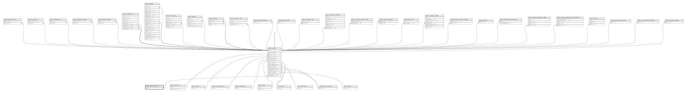

# public.profile_statuses

## Description

## Columns

| Name | Type        | Default                                      | Nullable | Children                        |
| ---- | ----------- | -------------------------------------------- | -------- | ------------------------------- |
| id   | bigint      | nextval('profile_statuses_id_seq'::regclass) | false    | [public.users](public.users.md) |
| slug | varchar(20) |                                              | false    |                                 |

## Constraints

| Name                         | Type        | Definition       |
| ---------------------------- | ----------- | ---------------- |
| profile_statuses_pkey        | PRIMARY KEY | PRIMARY KEY (id) |
| profile_statuses_slug_unique | UNIQUE      | UNIQUE (slug)    |

## Indexes

| Name                         | Definition                                                                                     |
| ---------------------------- | ---------------------------------------------------------------------------------------------- |
| profile_statuses_pkey        | CREATE UNIQUE INDEX profile_statuses_pkey ON public.profile_statuses USING btree (id)          |
| profile_statuses_slug_unique | CREATE UNIQUE INDEX profile_statuses_slug_unique ON public.profile_statuses USING btree (slug) |

## Relations

---

> Generated by [tbls](https://github.com/k1LoW/tbls)
