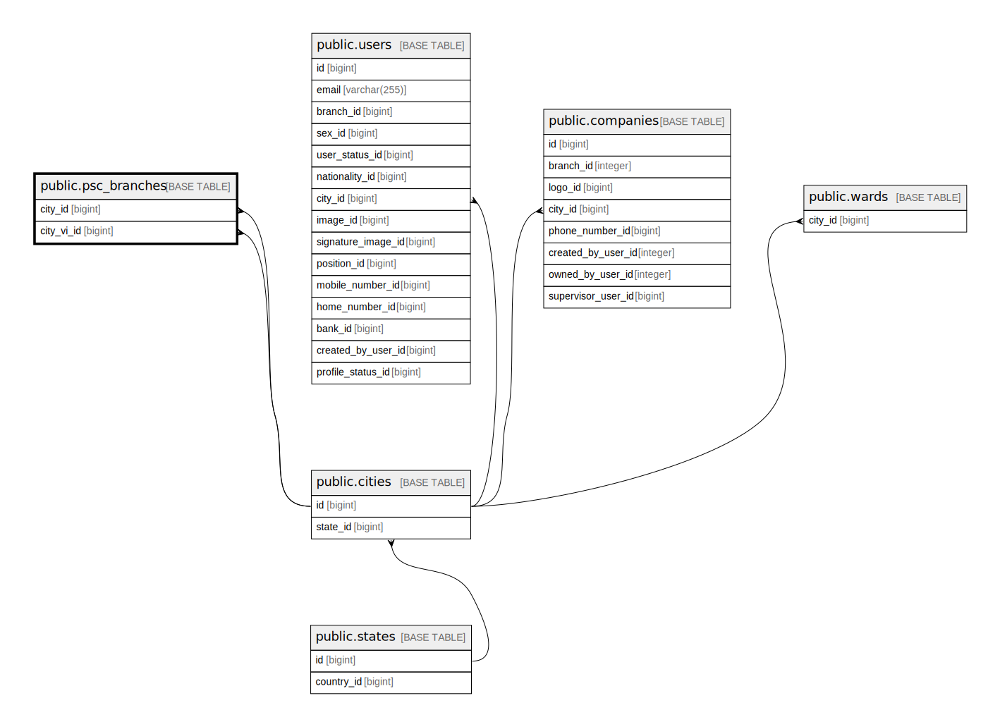

# public.psc_branches

## Description

## Columns

| Name                | Type                           | Default                                  | Nullable | Parents                           |
| ------------------- | ------------------------------ | ---------------------------------------- | -------- | --------------------------------- |
| id                  | bigint                         | nextval('psc_branches_id_seq'::regclass) | false    |                                   |
| code                | varchar(10)                    |                                          | false    |                                   |
| name                | varchar(255)                   |                                          | false    |                                   |
| address             | varchar(255)                   |                                          | false    |                                   |
| working_time        | varchar(255)                   |                                          | false    |                                   |
| working_time_sunday | varchar(255)                   |                                          | true     |                                   |
| latitude            | double precision               |                                          | true     |                                   |
| longitude           | double precision               |                                          | true     |                                   |
| city_id             | bigint                         |                                          | false    | [public.cities](public.cities.md) |
| created_at          | timestamp(0) without time zone |                                          | true     |                                   |
| updated_at          | timestamp(0) without time zone |                                          | true     |                                   |
| name_vi             | varchar(255)                   |                                          | true     |                                   |
| address_vi          | varchar(255)                   |                                          | true     |                                   |
| city_vi_id          | bigint                         |                                          | true     | [public.cities](public.cities.md) |

## Constraints

| Name                            | Type        | Definition                                                       |
| ------------------------------- | ----------- | ---------------------------------------------------------------- |
| psc_branches_city_id_foreign    | FOREIGN KEY | FOREIGN KEY (city_id) REFERENCES cities(id) ON DELETE CASCADE    |
| psc_branches_city_vi_id_foreign | FOREIGN KEY | FOREIGN KEY (city_vi_id) REFERENCES cities(id) ON DELETE CASCADE |
| psc_branches_pkey               | PRIMARY KEY | PRIMARY KEY (id)                                                 |

## Indexes

| Name              | Definition                                                                    |
| ----------------- | ----------------------------------------------------------------------------- |
| psc_branches_pkey | CREATE UNIQUE INDEX psc_branches_pkey ON public.psc_branches USING btree (id) |

## Relations

---

> Generated by [tbls](https://github.com/k1LoW/tbls)
