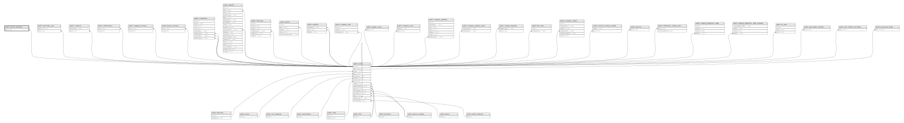

# public.recent_searches

## Description

## Columns

| Name                     | Type                           | Default                                     | Nullable | Parents                         |
| ------------------------ | ------------------------------ | ------------------------------------------- | -------- | ------------------------------- |
| id                       | bigint                         | nextval('recent_searches_id_seq'::regclass) | false    |                                 |
| created_at               | timestamp(0) without time zone |                                             | true     |                                 |
| updated_at               | timestamp(0) without time zone |                                             | true     |                                 |
| user_id                  | bigint                         |                                             | false    | [public.users](public.users.md) |
| recently_searchable_type | varchar(255)                   |                                             | false    |                                 |
| recently_searchable_id   | bigint                         |                                             | false    |                                 |

## Constraints

| Name                            | Type        | Definition                                                   |
| ------------------------------- | ----------- | ------------------------------------------------------------ |
| recent_searches_user_id_foreign | FOREIGN KEY | FOREIGN KEY (user_id) REFERENCES users(id) ON DELETE CASCADE |
| recent_searches_pkey            | PRIMARY KEY | PRIMARY KEY (id)                                             |

## Indexes

| Name                 | Definition                                                                          |
| -------------------- | ----------------------------------------------------------------------------------- |
| recent_searches_pkey | CREATE UNIQUE INDEX recent_searches_pkey ON public.recent_searches USING btree (id) |

## Relations

---

> Generated by [tbls](https://github.com/k1LoW/tbls)
