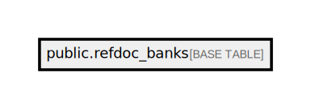

# public.refdoc_banks

## Description

## Columns

| Name               | Type                           | Default                                  | Nullable |
| ------------------ | ------------------------------ | ---------------------------------------- | -------- |
| id                 | bigint                         | nextval('refdoc_banks_id_seq'::regclass) | false    |
| name               | varchar(255)                   |                                          | false    |
| code               | varchar(255)                   |                                          | false    |
| bin                | varchar(255)                   |                                          | false    |
| short_name         | varchar(255)                   |                                          | false    |
| logo               | varchar(255)                   |                                          | false    |
| swift_code         | varchar(255)                   |                                          | true     |
| transfer_supported | boolean                        |                                          | false    |
| lookup_supported   | boolean                        |                                          | false    |
| support            | smallint                       |                                          | false    |
| is_transfer        | boolean                        |                                          | false    |
| source             | varchar(50)                    |                                          | false    |
| deleted_at         | timestamp(0) without time zone |                                          | true     |
| created_at         | timestamp(0) without time zone |                                          | true     |
| updated_at         | timestamp(0) without time zone |                                          | true     |

## Constraints

| Name                     | Type        | Definition       |
| ------------------------ | ----------- | ---------------- |
| refdoc_banks_pkey        | PRIMARY KEY | PRIMARY KEY (id) |
| refdoc_banks_code_unique | UNIQUE      | UNIQUE (code)    |

## Indexes

| Name                     | Definition                                                                             |
| ------------------------ | -------------------------------------------------------------------------------------- |
| refdoc_banks_pkey        | CREATE UNIQUE INDEX refdoc_banks_pkey ON public.refdoc_banks USING btree (id)          |
| refdoc_banks_code_unique | CREATE UNIQUE INDEX refdoc_banks_code_unique ON public.refdoc_banks USING btree (code) |

## Relations

---

> Generated by [tbls](https://github.com/k1LoW/tbls)
