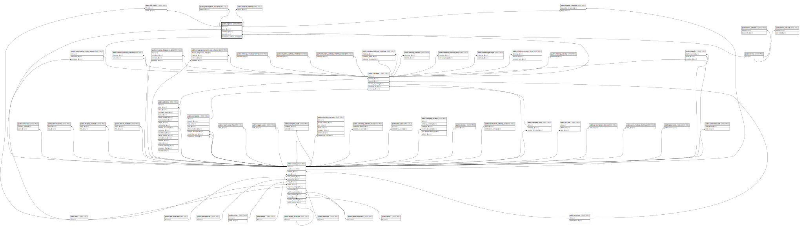

# public.reports

## Description

## Columns

| Name                        | Type                           | Default                             | Nullable | Children                                                                                                                                                                                                                | Parents                                                                 |
| --------------------------- | ------------------------------ | ----------------------------------- | -------- | ----------------------------------------------------------------------------------------------------------------------------------------------------------------------------------------------------------------------- | ----------------------------------------------------------------------- |
| id                          | bigint                         | nextval('reports_id_seq'::regclass) | false    | [public.file_report](public.file_report.md) [public.change_requests](public.change_requests.md) [public.prescription_histories](public.prescription_histories.md) [public.internal_reports](public.internal_reports.md) |                                                                         |
| user_id                     | bigint                         |                                     | true     |                                                                                                                                                                                                                         | [public.users](public.users.md)                                         |
| checkup_id                  | bigint                         |                                     | false    |                                                                                                                                                                                                                         | [public.checkups](public.checkups.md)                                   |
| form_id                     | bigint                         |                                     | false    |                                                                                                                                                                                                                         | [public.forms](public.forms.md)                                         |
| created_at                  | timestamp(0) without time zone |                                     | true     |                                                                                                                                                                                                                         |                                                                         |
| updated_at                  | timestamp(0) without time zone |                                     | true     |                                                                                                                                                                                                                         |                                                                         |
| examination_refuse_waver_id | bigint                         |                                     | true     |                                                                                                                                                                                                                         | [public.examination_refuse_wavers](public.examination_refuse_wavers.md) |
| content                     | json                           |                                     | true     |                                                                                                                                                                                                                         |                                                                         |
| refused                     | boolean                        | false                               | false    |                                                                                                                                                                                                                         |                                                                         |
| extra_data                  | json                           |                                     | true     |                                                                                                                                                                                                                         |                                                                         |

## Constraints

| Name                                        | Type        | Definition                                                                                           |
| ------------------------------------------- | ----------- | ---------------------------------------------------------------------------------------------------- |
| reports_user_id_foreign                     | FOREIGN KEY | FOREIGN KEY (user_id) REFERENCES users(id) ON DELETE CASCADE                                         |
| reports_form_id_foreign                     | FOREIGN KEY | FOREIGN KEY (form_id) REFERENCES forms(id) ON DELETE CASCADE                                         |
| reports_checkup_id_foreign                  | FOREIGN KEY | FOREIGN KEY (checkup_id) REFERENCES checkups(id) ON DELETE CASCADE                                   |
| reports_pkey                                | PRIMARY KEY | PRIMARY KEY (id)                                                                                     |
| reports_checkup_id_form_id_unique           | UNIQUE      | UNIQUE (checkup_id, form_id)                                                                         |
| reports_examination_refuse_waver_id_foreign | FOREIGN KEY | FOREIGN KEY (examination_refuse_waver_id) REFERENCES examination_refuse_wavers(id) ON DELETE CASCADE |

## Indexes

| Name                              | Definition                                                                                                |
| --------------------------------- | --------------------------------------------------------------------------------------------------------- |
| reports_pkey                      | CREATE UNIQUE INDEX reports_pkey ON public.reports USING btree (id)                                       |
| reports_checkup_id_form_id_unique | CREATE UNIQUE INDEX reports_checkup_id_form_id_unique ON public.reports USING btree (checkup_id, form_id) |

## Relations

---

> Generated by [tbls](https://github.com/k1LoW/tbls)
