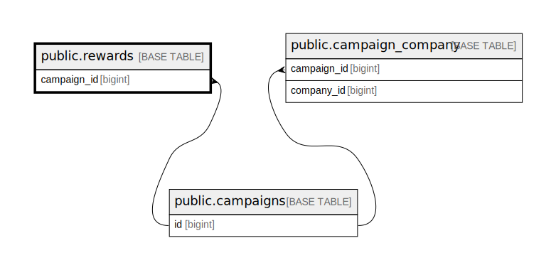

# public.rewards

## Description

## Columns

| Name        | Type                           | Default                             | Nullable | Parents                                 |
| ----------- | ------------------------------ | ----------------------------------- | -------- | --------------------------------------- |
| id          | bigint                         | nextval('rewards_id_seq'::regclass) | false    |                                         |
| name        | varchar(255)                   |                                     | false    |                                         |
| name_vi     | varchar(255)                   |                                     | false    |                                         |
| level       | integer                        |                                     | false    |                                         |
| classname   | varchar(255)                   |                                     | false    |                                         |
| voucher     | json                           |                                     | true     |                                         |
| campaign_id | bigint                         |                                     | true     | [public.campaigns](public.campaigns.md) |
| created_at  | timestamp(0) without time zone |                                     | true     |                                         |
| updated_at  | timestamp(0) without time zone |                                     | true     |                                         |

## Constraints

| Name                                       | Type        | Definition                                                           |
| ------------------------------------------ | ----------- | -------------------------------------------------------------------- |
| rewards_campaign_id_foreign                | FOREIGN KEY | FOREIGN KEY (campaign_id) REFERENCES campaigns(id) ON DELETE CASCADE |
| rewards_pkey                               | PRIMARY KEY | PRIMARY KEY (id)                                                     |
| rewards_campaign_id_classname_level_unique | UNIQUE      | UNIQUE (campaign_id, classname, level)                               |

## Indexes

| Name                                       | Definition                                                                                                                   |
| ------------------------------------------ | ---------------------------------------------------------------------------------------------------------------------------- |
| rewards_pkey                               | CREATE UNIQUE INDEX rewards_pkey ON public.rewards USING btree (id)                                                          |
| rewards_campaign_id_classname_level_unique | CREATE UNIQUE INDEX rewards_campaign_id_classname_level_unique ON public.rewards USING btree (campaign_id, classname, level) |

## Relations

---

> Generated by [tbls](https://github.com/k1LoW/tbls)
