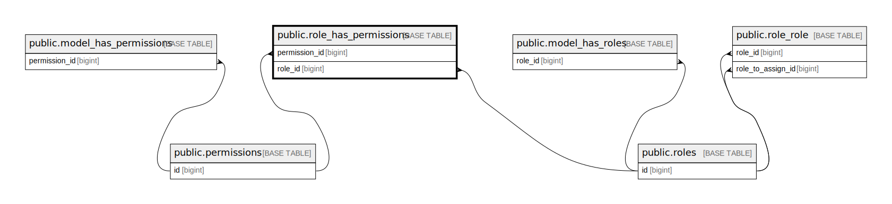

# public.role_has_permissions

## Description

## Columns

| Name          | Type   | Default | Nullable | Parents                                     |
| ------------- | ------ | ------- | -------- | ------------------------------------------- |
| permission_id | bigint |         | false    | [public.permissions](public.permissions.md) |
| role_id       | bigint |         | false    | [public.roles](public.roles.md)             |

## Constraints

| Name                                       | Type        | Definition                                                               |
| ------------------------------------------ | ----------- | ------------------------------------------------------------------------ |
| role_has_permissions_permission_id_foreign | FOREIGN KEY | FOREIGN KEY (permission_id) REFERENCES permissions(id) ON DELETE CASCADE |
| role_has_permissions_role_id_foreign       | FOREIGN KEY | FOREIGN KEY (role_id) REFERENCES roles(id) ON DELETE CASCADE             |
| role_has_permissions_pkey                  | PRIMARY KEY | PRIMARY KEY (permission_id, role_id)                                     |

## Indexes

| Name                      | Definition                                                                                                        |
| ------------------------- | ----------------------------------------------------------------------------------------------------------------- |
| role_has_permissions_pkey | CREATE UNIQUE INDEX role_has_permissions_pkey ON public.role_has_permissions USING btree (permission_id, role_id) |

## Relations

---

> Generated by [tbls](https://github.com/k1LoW/tbls)
