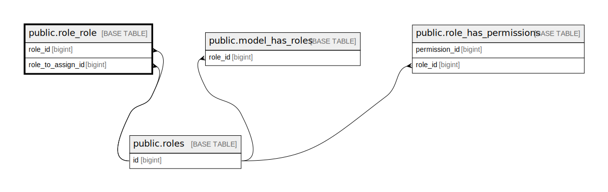

# public.role_role

## Description

## Columns

| Name              | Type   | Default                               | Nullable | Parents                         |
| ----------------- | ------ | ------------------------------------- | -------- | ------------------------------- |
| id                | bigint | nextval('role_role_id_seq'::regclass) | false    |                                 |
| role_id           | bigint |                                       | false    | [public.roles](public.roles.md) |
| role_to_assign_id | bigint |                                       | false    | [public.roles](public.roles.md) |

## Constraints

| Name                                | Type        | Definition                                                             |
| ----------------------------------- | ----------- | ---------------------------------------------------------------------- |
| role_role_role_id_foreign           | FOREIGN KEY | FOREIGN KEY (role_id) REFERENCES roles(id) ON DELETE CASCADE           |
| role_role_role_to_assign_id_foreign | FOREIGN KEY | FOREIGN KEY (role_to_assign_id) REFERENCES roles(id) ON DELETE CASCADE |
| role_role_pkey                      | PRIMARY KEY | PRIMARY KEY (id)                                                       |

## Indexes

| Name           | Definition                                                              |
| -------------- | ----------------------------------------------------------------------- |
| role_role_pkey | CREATE UNIQUE INDEX role_role_pkey ON public.role_role USING btree (id) |

## Relations

---

> Generated by [tbls](https://github.com/k1LoW/tbls)
