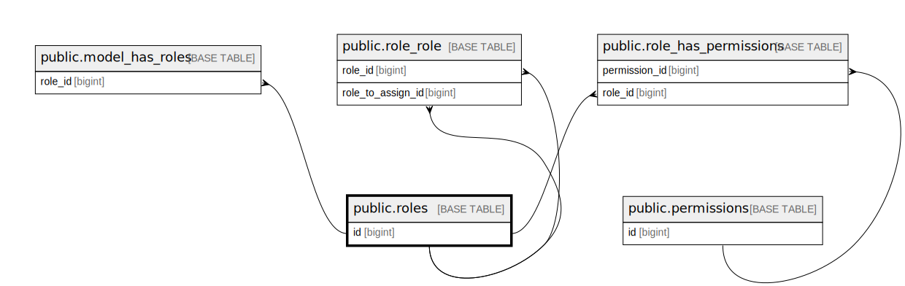

# public.roles

## Description

## Columns

| Name       | Type                           | Default                           | Nullable | Children                                                                                                                                                  |
| ---------- | ------------------------------ | --------------------------------- | -------- | --------------------------------------------------------------------------------------------------------------------------------------------------------- |
| id         | bigint                         | nextval('roles_id_seq'::regclass) | false    | [public.model_has_roles](public.model_has_roles.md) [public.role_has_permissions](public.role_has_permissions.md) [public.role_role](public.role_role.md) |
| name       | varchar(255)                   |                                   | false    |                                                                                                                                                           |
| guard_name | varchar(255)                   |                                   | false    |                                                                                                                                                           |
| created_at | timestamp(0) without time zone |                                   | true     |                                                                                                                                                           |
| updated_at | timestamp(0) without time zone |                                   | true     |                                                                                                                                                           |

## Constraints

| Name       | Type        | Definition       |
| ---------- | ----------- | ---------------- |
| roles_pkey | PRIMARY KEY | PRIMARY KEY (id) |

## Indexes

| Name       | Definition                                                      |
| ---------- | --------------------------------------------------------------- |
| roles_pkey | CREATE UNIQUE INDEX roles_pkey ON public.roles USING btree (id) |

## Relations

---

> Generated by [tbls](https://github.com/k1LoW/tbls)
