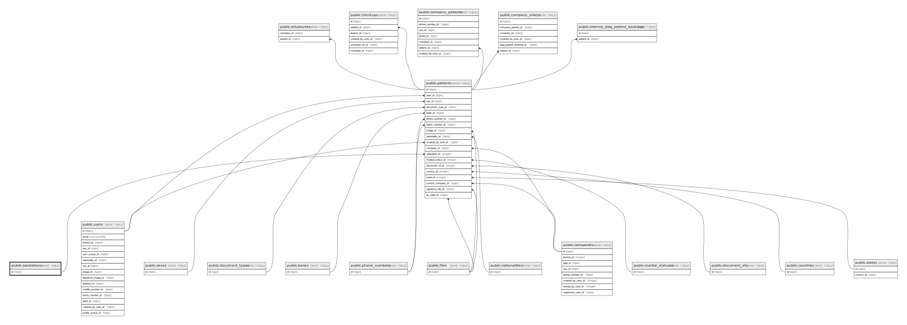

# public.salutations

## Description

## Columns

| Name | Type         | Default                                 | Nullable | Children                              |
| ---- | ------------ | --------------------------------------- | -------- | ------------------------------------- |
| id   | bigint       | nextval('salutations_id_seq'::regclass) | false    | [public.patients](public.patients.md) |
| name | varchar(255) |                                         | false    |                                       |
| slug | varchar(255) |                                         | false    |                                       |

## Constraints

| Name             | Type        | Definition       |
| ---------------- | ----------- | ---------------- |
| salutations_pkey | PRIMARY KEY | PRIMARY KEY (id) |

## Indexes

| Name             | Definition                                                                  |
| ---------------- | --------------------------------------------------------------------------- |
| salutations_pkey | CREATE UNIQUE INDEX salutations_pkey ON public.salutations USING btree (id) |

## Relations

---

> Generated by [tbls](https://github.com/k1LoW/tbls)
