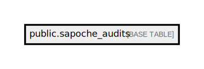

# public.sapoche_audits

## Description

## Columns

| Name           | Type                           | Default                                    | Nullable |
| -------------- | ------------------------------ | ------------------------------------------ | -------- |
| id             | bigint                         | nextval('sapoche_audits_id_seq'::regclass) | false    |
| event_type     | varchar(255)                   |                                            | false    |
| aggregate_id   | varchar(255)                   |                                            | false    |
| aggregate_type | varchar(255)                   |                                            | false    |
| payload        | json                           |                                            | false    |
| created_at     | timestamp(0) without time zone |                                            | true     |
| updated_at     | timestamp(0) without time zone |                                            | true     |

## Constraints

| Name                | Type        | Definition       |
| ------------------- | ----------- | ---------------- |
| sapoche_audits_pkey | PRIMARY KEY | PRIMARY KEY (id) |

## Indexes

| Name                | Definition                                                                        |
| ------------------- | --------------------------------------------------------------------------------- |
| sapoche_audits_pkey | CREATE UNIQUE INDEX sapoche_audits_pkey ON public.sapoche_audits USING btree (id) |

## Relations

---

> Generated by [tbls](https://github.com/k1LoW/tbls)
