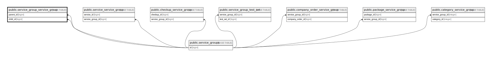

# public.service_group_service_group

## Description

## Columns

| Name      | Type   | Default                                                 | Nullable | Parents                                           |
| --------- | ------ | ------------------------------------------------------- | -------- | ------------------------------------------------- |
| id        | bigint | nextval('service_group_service_group_id_seq'::regclass) | false    |                                                   |
| parent_id | bigint |                                                         | false    | [public.service_groups](public.service_groups.md) |
| child_id  | bigint |                                                         | false    | [public.service_groups](public.service_groups.md) |

## Constraints

| Name                                          | Type        | Definition                                                               |
| --------------------------------------------- | ----------- | ------------------------------------------------------------------------ |
| service_group_service_group_child_id_foreign  | FOREIGN KEY | FOREIGN KEY (child_id) REFERENCES service_groups(id) ON DELETE SET NULL  |
| service_group_service_group_parent_id_foreign | FOREIGN KEY | FOREIGN KEY (parent_id) REFERENCES service_groups(id) ON DELETE SET NULL |
| service_group_service_group_pkey              | PRIMARY KEY | PRIMARY KEY (id)                                                         |

## Indexes

| Name                             | Definition                                                                                                  |
| -------------------------------- | ----------------------------------------------------------------------------------------------------------- |
| service_group_service_group_pkey | CREATE UNIQUE INDEX service_group_service_group_pkey ON public.service_group_service_group USING btree (id) |

## Relations

---

> Generated by [tbls](https://github.com/k1LoW/tbls)
