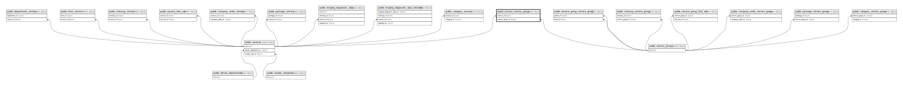

# public.service_service_group

## Description

## Columns

| Name             | Type    | Default                                           | Nullable | Parents                                           |
| ---------------- | ------- | ------------------------------------------------- | -------- | ------------------------------------------------- |
| id               | bigint  | nextval('service_service_group_id_seq'::regclass) | false    |                                                   |
| service_id       | bigint  |                                                   | false    | [public.services](public.services.md)             |
| service_group_id | bigint  |                                                   | false    | [public.service_groups](public.service_groups.md) |
| order            | integer |                                                   | true     |                                                   |

## Constraints

| Name                                           | Type        | Definition                                                                     |
| ---------------------------------------------- | ----------- | ------------------------------------------------------------------------------ |
| service_service_group_service_group_id_foreign | FOREIGN KEY | FOREIGN KEY (service_group_id) REFERENCES service_groups(id) ON DELETE CASCADE |
| service_service_group_service_id_foreign       | FOREIGN KEY | FOREIGN KEY (service_id) REFERENCES services(id) ON DELETE CASCADE             |
| service_service_group_pkey                     | PRIMARY KEY | PRIMARY KEY (id)                                                               |

## Indexes

| Name                       | Definition                                                                                      |
| -------------------------- | ----------------------------------------------------------------------------------------------- |
| service_service_group_pkey | CREATE UNIQUE INDEX service_service_group_pkey ON public.service_service_group USING btree (id) |

## Relations

---

> Generated by [tbls](https://github.com/k1LoW/tbls)
