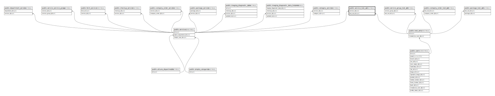

# public.service_test_set

## Description

## Columns

| Name        | Type                           | Default                                      | Nullable | Parents                                 |
| ----------- | ------------------------------ | -------------------------------------------- | -------- | --------------------------------------- |
| id          | bigint                         | nextval('service_test_set_id_seq'::regclass) | false    |                                         |
| service_id  | bigint                         |                                              | false    | [public.services](public.services.md)   |
| test_set_id | bigint                         |                                              | false    | [public.test_sets](public.test_sets.md) |
| created_at  | timestamp(0) without time zone |                                              | true     |                                         |
| updated_at  | timestamp(0) without time zone |                                              | true     |                                         |

## Constraints

| Name                                 | Type        | Definition                                                           |
| ------------------------------------ | ----------- | -------------------------------------------------------------------- |
| service_test_set_service_id_foreign  | FOREIGN KEY | FOREIGN KEY (service_id) REFERENCES services(id) ON DELETE CASCADE   |
| service_test_set_test_set_id_foreign | FOREIGN KEY | FOREIGN KEY (test_set_id) REFERENCES test_sets(id) ON DELETE CASCADE |
| service_test_set_pkey                | PRIMARY KEY | PRIMARY KEY (id)                                                     |

## Indexes

| Name                               | Definition                                                                                           |
| ---------------------------------- | ---------------------------------------------------------------------------------------------------- |
| service_test_set_pkey              | CREATE UNIQUE INDEX service_test_set_pkey ON public.service_test_set USING btree (id)                |
| service_test_set_service_id_index  | CREATE INDEX service_test_set_service_id_index ON public.service_test_set USING btree (service_id)   |
| service_test_set_test_set_id_index | CREATE INDEX service_test_set_test_set_id_index ON public.service_test_set USING btree (test_set_id) |

## Relations

---

> Generated by [tbls](https://github.com/k1LoW/tbls)
