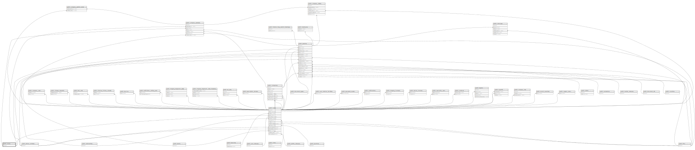

# public.sexes

## Description

## Columns

| Name | Type         | Default                           | Nullable | Children                                                                                                                    |
| ---- | ------------ | --------------------------------- | -------- | --------------------------------------------------------------------------------------------------------------------------- |
| id   | bigint       | nextval('sexes_id_seq'::regclass) | false    | [public.users](public.users.md) [public.patients](public.patients.md) [public.company_patients](public.company_patients.md) |
| slug | varchar(255) |                                   | false    |                                                                                                                             |
| name | varchar(255) |                                   | false    |                                                                                                                             |

## Constraints

| Name              | Type        | Definition       |
| ----------------- | ----------- | ---------------- |
| sexes_pkey        | PRIMARY KEY | PRIMARY KEY (id) |
| sexes_slug_unique | UNIQUE      | UNIQUE (slug)    |

## Indexes

| Name              | Definition                                                               |
| ----------------- | ------------------------------------------------------------------------ |
| sexes_pkey        | CREATE UNIQUE INDEX sexes_pkey ON public.sexes USING btree (id)          |
| sexes_slug_unique | CREATE UNIQUE INDEX sexes_slug_unique ON public.sexes USING btree (slug) |

## Relations

---

> Generated by [tbls](https://github.com/k1LoW/tbls)
