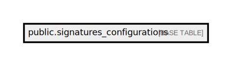

# public.signatures_configurations

## Description

## Columns

| Name                      | Type                           | Default                                               | Nullable |
| ------------------------- | ------------------------------ | ----------------------------------------------------- | -------- |
| id                        | bigint                         | nextval('signatures_configurations_id_seq'::regclass) | false    |
| signature_key             | varchar(255)                   |                                                       | false    |
| digital_signature_enabled | boolean                        | true                                                  | false    |
| image_signature_enabled   | boolean                        | false                                                 | false    |
| deleted_at                | timestamp(0) without time zone |                                                       | true     |
| created_at                | timestamp(0) without time zone |                                                       | true     |
| updated_at                | timestamp(0) without time zone |                                                       | true     |
| section                   | varchar(255)                   |                                                       | true     |

## Constraints

| Name                                                   | Type        | Definition                      |
| ------------------------------------------------------ | ----------- | ------------------------------- |
| signatures_configurations_pkey                         | PRIMARY KEY | PRIMARY KEY (id)                |
| signatures_configurations_signature_key_section_unique | UNIQUE      | UNIQUE (signature_key, section) |

## Indexes

| Name                                                   | Definition                                                                                                                                          |
| ------------------------------------------------------ | --------------------------------------------------------------------------------------------------------------------------------------------------- |
| signatures_configurations_pkey                         | CREATE UNIQUE INDEX signatures_configurations_pkey ON public.signatures_configurations USING btree (id)                                             |
| signature_key_index                                    | CREATE INDEX signature_key_index ON public.signatures_configurations USING btree (signature_key)                                                    |
| signatures_configurations_signature_key_section_unique | CREATE UNIQUE INDEX signatures_configurations_signature_key_section_unique ON public.signatures_configurations USING btree (signature_key, section) |

## Relations

---

> Generated by [tbls](https://github.com/k1LoW/tbls)
