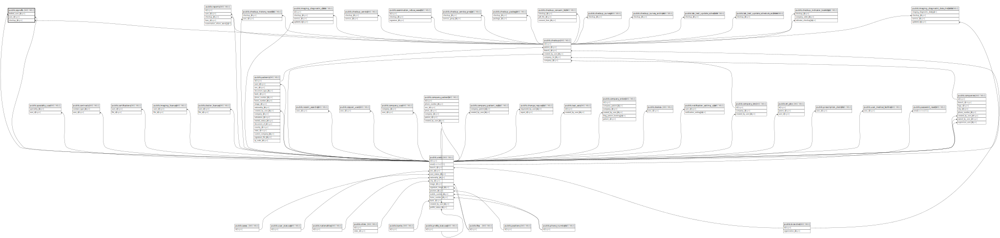

# public.signoffs

## Description

## Columns

| Name                   | Type                           | Default                              | Nullable | Parents                               |
| ---------------------- | ------------------------------ | ------------------------------------ | -------- | ------------------------------------- |
| id                     | bigint                         | nextval('signoffs_id_seq'::regclass) | false    |                                       |
| conclusion             | text                           |                                      | true     |                                       |
| recommendations        | text                           |                                      | true     |                                       |
| overall_classification | text                           |                                      | true     |                                       |
| signed_at              | timestamp(0) without time zone |                                      | true     |                                       |
| drafted_user_id        | bigint                         |                                      | true     | [public.users](public.users.md)       |
| user_id                | bigint                         |                                      | true     | [public.users](public.users.md)       |
| checkup_id             | bigint                         |                                      | false    | [public.checkups](public.checkups.md) |
| created_at             | timestamp(0) without time zone |                                      | true     |                                       |
| updated_at             | timestamp(0) without time zone |                                      | true     |                                       |
| extra_data             | json                           |                                      | true     |                                       |
| type                   | varchar(255)                   | ''::character varying                | true     |                                       |

## Constraints

| Name                             | Type        | Definition                                                            |
| -------------------------------- | ----------- | --------------------------------------------------------------------- |
| signoffs_drafted_user_id_foreign | FOREIGN KEY | FOREIGN KEY (drafted_user_id) REFERENCES users(id) ON DELETE SET NULL |
| signoffs_user_id_foreign         | FOREIGN KEY | FOREIGN KEY (user_id) REFERENCES users(id) ON DELETE SET NULL         |
| signoffs_checkup_id_foreign      | FOREIGN KEY | FOREIGN KEY (checkup_id) REFERENCES checkups(id) ON DELETE CASCADE    |
| signoffs_pkey                    | PRIMARY KEY | PRIMARY KEY (id)                                                      |

## Indexes

| Name          | Definition                                                            |
| ------------- | --------------------------------------------------------------------- |
| signoffs_pkey | CREATE UNIQUE INDEX signoffs_pkey ON public.signoffs USING btree (id) |

## Relations

---

> Generated by [tbls](https://github.com/k1LoW/tbls)
