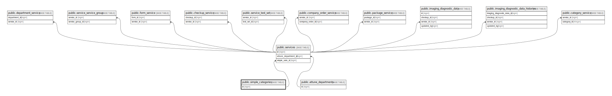

# public.simple_categories

## Description

## Columns

| Name            | Type                           | Default                                       | Nullable | Children                              |
| --------------- | ------------------------------ | --------------------------------------------- | -------- | ------------------------------------- |
| id              | bigint                         | nextval('simple_categories_id_seq'::regclass) | false    | [public.services](public.services.md) |
| name            | varchar(255)                   |                                               | false    |                                       |
| name_vi         | varchar(255)                   |                                               | false    |                                       |
| created_at      | timestamp(0) without time zone |                                               | true     |                                       |
| updated_at      | timestamp(0) without time zone |                                               | true     |                                       |
| order_in_report | smallint                       |                                               | true     |                                       |

## Constraints

| Name                   | Type        | Definition       |
| ---------------------- | ----------- | ---------------- |
| simple_categories_pkey | PRIMARY KEY | PRIMARY KEY (id) |

## Indexes

| Name                   | Definition                                                                              |
| ---------------------- | --------------------------------------------------------------------------------------- |
| simple_categories_pkey | CREATE UNIQUE INDEX simple_categories_pkey ON public.simple_categories USING btree (id) |

## Relations

---

> Generated by [tbls](https://github.com/k1LoW/tbls)
