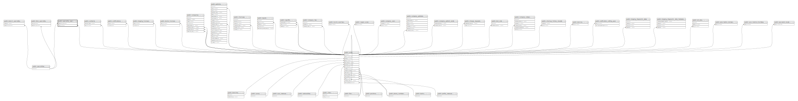

# public.speciality_user

## Description

## Columns

| Name          | Type   | Default                                     | Nullable | Parents                                       |
| ------------- | ------ | ------------------------------------------- | -------- | --------------------------------------------- |
| id            | bigint | nextval('speciality_user_id_seq'::regclass) | false    |                                               |
| speciality_id | bigint |                                             | false    | [public.specialities](public.specialities.md) |
| user_id       | bigint |                                             | false    | [public.users](public.users.md)               |

## Constraints

| Name                                  | Type        | Definition                                                                |
| ------------------------------------- | ----------- | ------------------------------------------------------------------------- |
| speciality_user_user_id_foreign       | FOREIGN KEY | FOREIGN KEY (user_id) REFERENCES users(id) ON DELETE CASCADE              |
| speciality_user_speciality_id_foreign | FOREIGN KEY | FOREIGN KEY (speciality_id) REFERENCES specialities(id) ON DELETE CASCADE |
| speciality_user_pkey                  | PRIMARY KEY | PRIMARY KEY (id)                                                          |

## Indexes

| Name                                | Definition                                                                                                      |
| ----------------------------------- | --------------------------------------------------------------------------------------------------------------- |
| speciality_user_pkey                | CREATE UNIQUE INDEX speciality_user_pkey ON public.speciality_user USING btree (id)                             |
| checkupsapi_su_userid_speciality_id | CREATE INDEX checkupsapi_su_userid_speciality_id ON public.speciality_user USING btree (user_id, speciality_id) |

## Relations

---

> Generated by [tbls](https://github.com/k1LoW/tbls)
