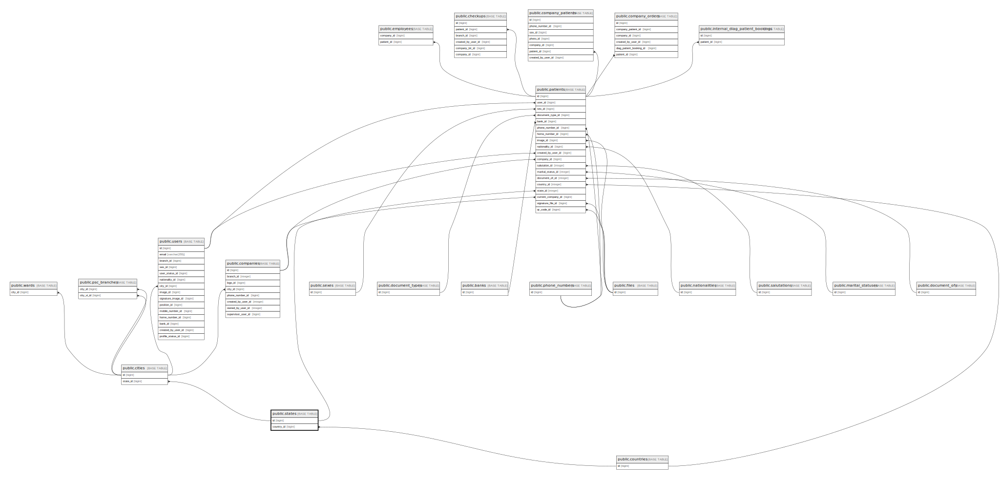

# public.states

## Description

## Columns

| Name            | Type         | Default                            | Nullable | Children                                                                | Parents                                 |
| --------------- | ------------ | ---------------------------------- | -------- | ----------------------------------------------------------------------- | --------------------------------------- |
| id              | bigint       | nextval('states_id_seq'::regclass) | false    | [public.cities](public.cities.md) [public.patients](public.patients.md) |                                         |
| name            | varchar(255) |                                    | false    |                                                                         |                                         |
| country_id      | bigint       |                                    | true     |                                                                         | [public.countries](public.countries.md) |
| is_cons_support | boolean      | false                              | false    |                                                                         |                                         |

## Constraints

| Name                      | Type        | Definition                                                           |
| ------------------------- | ----------- | -------------------------------------------------------------------- |
| states_country_id_foreign | FOREIGN KEY | FOREIGN KEY (country_id) REFERENCES countries(id) ON DELETE SET NULL |
| states_pkey               | PRIMARY KEY | PRIMARY KEY (id)                                                     |

## Indexes

| Name        | Definition                                                        |
| ----------- | ----------------------------------------------------------------- |
| states_pkey | CREATE UNIQUE INDEX states_pkey ON public.states USING btree (id) |

## Relations

---

> Generated by [tbls](https://github.com/k1LoW/tbls)
