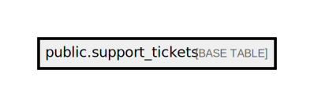

# public.support_tickets

## Description

## Columns

| Name         | Type                           | Default                                     | Nullable |
| ------------ | ------------------------------ | ------------------------------------------- | -------- |
| id           | bigint                         | nextval('support_tickets_id_seq'::regclass) | false    |
| full_name    | varchar(255)                   |                                             | false    |
| account_code | varchar(255)                   |                                             | true     |
| phone        | varchar(25)                    |                                             | true     |
| email        | varchar(255)                   |                                             | true     |
| message      | text                           |                                             | true     |
| created_at   | timestamp(0) without time zone |                                             | true     |
| updated_at   | timestamp(0) without time zone |                                             | true     |
| request_type | varchar(100)                   |                                             | false    |
| account_type | varchar(100)                   |                                             | false    |

## Constraints

| Name                 | Type        | Definition       |
| -------------------- | ----------- | ---------------- |
| support_tickets_pkey | PRIMARY KEY | PRIMARY KEY (id) |

## Indexes

| Name                 | Definition                                                                          |
| -------------------- | ----------------------------------------------------------------------------------- |
| support_tickets_pkey | CREATE UNIQUE INDEX support_tickets_pkey ON public.support_tickets USING btree (id) |

## Relations

---

> Generated by [tbls](https://github.com/k1LoW/tbls)
