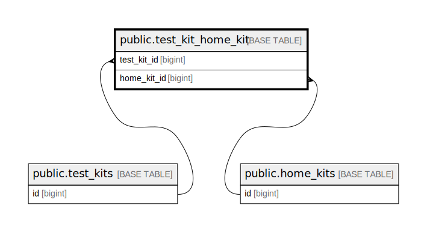

# public.test_kit_home_kit

## Description

## Columns

| Name        | Type   | Default                                       | Nullable | Parents                                 | Comment     |
| ----------- | ------ | --------------------------------------------- | -------- | --------------------------------------- | ----------- |
| id          | bigint | nextval('test_kit_home_kit_id_seq'::regclass) | false    |                                         |             |
| test_kit_id | bigint |                                               | false    | [public.test_kits](public.test_kits.md) | Test kit ID |
| home_kit_id | bigint |                                               | false    | [public.home_kits](public.home_kits.md) | Home kit ID |

## Constraints

| Name                                             | Type        | Definition                                                           |
| ------------------------------------------------ | ----------- | -------------------------------------------------------------------- |
| test_kit_home_kit_home_kit_id_foreign            | FOREIGN KEY | FOREIGN KEY (home_kit_id) REFERENCES home_kits(id) ON DELETE CASCADE |
| test_kit_home_kit_test_kit_id_foreign            | FOREIGN KEY | FOREIGN KEY (test_kit_id) REFERENCES test_kits(id) ON DELETE CASCADE |
| test_kit_home_kit_pkey                           | PRIMARY KEY | PRIMARY KEY (id)                                                     |
| test_kit_home_kit_test_kit_id_home_kit_id_unique | UNIQUE      | UNIQUE (test_kit_id, home_kit_id)                                    |

## Indexes

| Name                                             | Definition                                                                                                                              |
| ------------------------------------------------ | --------------------------------------------------------------------------------------------------------------------------------------- |
| test_kit_home_kit_pkey                           | CREATE UNIQUE INDEX test_kit_home_kit_pkey ON public.test_kit_home_kit USING btree (id)                                                 |
| test_kit_home_kit_test_kit_id_home_kit_id_unique | CREATE UNIQUE INDEX test_kit_home_kit_test_kit_id_home_kit_id_unique ON public.test_kit_home_kit USING btree (test_kit_id, home_kit_id) |
| test_kit_home_kit_home_kit_id_index              | CREATE INDEX test_kit_home_kit_home_kit_id_index ON public.test_kit_home_kit USING btree (home_kit_id)                                  |

## Relations

---

> Generated by [tbls](https://github.com/k1LoW/tbls)
