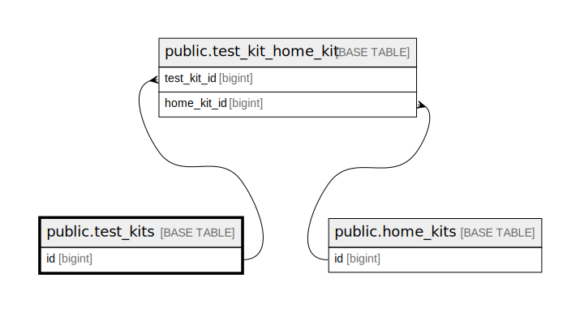

# public.test_kits

## Description

## Columns

| Name                 | Type                           | Default                               | Nullable | Children                                                | Comment                          |
| -------------------- | ------------------------------ | ------------------------------------- | -------- | ------------------------------------------------------- | -------------------------------- |
| id                   | bigint                         | nextval('test_kits_id_seq'::regclass) | false    | [public.test_kit_home_kit](public.test_kit_home_kit.md) |                                  |
| sku                  | varchar(255)                   |                                       | false    |                                                         | Test kit stock-keeping unit code |
| test_code            | varchar(255)                   |                                       | false    |                                                         | Code of each test                |
| test_type            | varchar(255)                   |                                       | false    |                                                         | Type of each test                |
| kit_name             | varchar(255)                   |                                       | false    |                                                         | Kit name                         |
| created_at           | timestamp(0) without time zone |                                       | true     |                                                         |                                  |
| updated_at           | timestamp(0) without time zone |                                       | true     |                                                         |                                  |
| video_instruction_id | varchar(50)                    |                                       | true     |                                                         |                                  |
| is_new_kit           | boolean                        | false                                 | false    |                                                         |                                  |
| gender               | varchar(255)                   |                                       | true     |                                                         |                                  |

## Constraints

| Name                           | Type        | Definition              |
| ------------------------------ | ----------- | ----------------------- |
| test_kits_pkey                 | PRIMARY KEY | PRIMARY KEY (id)        |
| test_kits_sku_test_code_unique | UNIQUE      | UNIQUE (sku, test_code) |

## Indexes

| Name                           | Definition                                                                                          |
| ------------------------------ | --------------------------------------------------------------------------------------------------- |
| test_kits_pkey                 | CREATE UNIQUE INDEX test_kits_pkey ON public.test_kits USING btree (id)                             |
| test_kits_sku_test_code_unique | CREATE UNIQUE INDEX test_kits_sku_test_code_unique ON public.test_kits USING btree (sku, test_code) |

## Relations

---

> Generated by [tbls](https://github.com/k1LoW/tbls)
