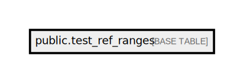

# public.test_ref_ranges

## Description

## Columns

| Name            | Type             | Default                                     | Nullable | Comment         |
| --------------- | ---------------- | ------------------------------------------- | -------- | --------------- |
| id              | bigint           | nextval('test_ref_ranges_id_seq'::regclass) | false    |                 |
| test_code       | varchar(255)     |                                             | false    |                 |
| test_name       | varchar(255)     |                                             | false    |                 |
| gender          | varchar(255)     |                                             | false    |                 |
| age_type        | varchar(255)     |                                             | false    |                 |
| age_opr         | varchar(255)     |                                             | false    |                 |
| age_min         | double precision |                                             | true     |                 |
| age_max         | double precision |                                             | true     |                 |
| value_opr       | varchar(255)     |                                             | false    |                 |
| value_min       | double precision |                                             | true     |                 |
| value_max       | double precision |                                             | true     |                 |
| value_txt       | varchar(255)     |                                             | true     |                 |
| result_label    | varchar(255)     |                                             | false    |                 |
| revision        | bigint           |                                             | false    |                 |
| result_type     | varchar(50)      |                                             | true     |                 |
| test_name_vi    | varchar(255)     |                                             | true     |                 |
| result_label_vi | varchar(255)     |                                             | true     |                 |
| status          | varchar(50)      |                                             | true     |                 |
| datediff_opr    | varchar(10)      |                                             | true     |                 |
| datediff_min    | double precision |                                             | true     |                 |
| datediff_max    | double precision |                                             | true     |                 |
| uom_code        | varchar(255)     |                                             | true     |                 |
| color           | varchar(255)     |                                             | true     | Ref range color |

## Constraints

| Name                 | Type        | Definition       |
| -------------------- | ----------- | ---------------- |
| test_ref_ranges_pkey | PRIMARY KEY | PRIMARY KEY (id) |

## Indexes

| Name                 | Definition                                                                          |
| -------------------- | ----------------------------------------------------------------------------------- |
| test_ref_ranges_pkey | CREATE UNIQUE INDEX test_ref_ranges_pkey ON public.test_ref_ranges USING btree (id) |

## Relations

---

> Generated by [tbls](https://github.com/k1LoW/tbls)
