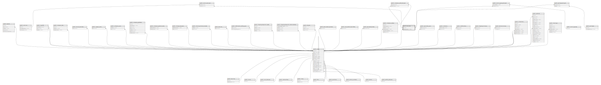

# public.test_sets

## Description

## Columns

| Name               | Type                           | Default                               | Nullable | Children                                                                                                                                                                                                                                        | Parents                         |
| ------------------ | ------------------------------ | ------------------------------------- | -------- | ----------------------------------------------------------------------------------------------------------------------------------------------------------------------------------------------------------------------------------------------- | ------------------------------- |
| id                 | bigint                         | nextval('test_sets_id_seq'::regclass) | false    | [public.service_test_set](public.service_test_set.md) [public.service_group_test_set](public.service_group_test_set.md) [public.company_order_test_set](public.company_order_test_set.md) [public.package_test_set](public.package_test_set.md) |                                 |
| name               | varchar(255)                   |                                       | false    |                                                                                                                                                                                                                                                 |                                 |
| order_count        | integer                        | 0                                     | false    |                                                                                                                                                                                                                                                 |                                 |
| created_by_user_id | bigint                         |                                       | true     |                                                                                                                                                                                                                                                 | [public.users](public.users.md) |
| deleted_at         | timestamp(0) without time zone |                                       | true     |                                                                                                                                                                                                                                                 |                                 |
| created_at         | timestamp(0) without time zone |                                       | true     |                                                                                                                                                                                                                                                 |                                 |
| updated_at         | timestamp(0) without time zone |                                       | true     |                                                                                                                                                                                                                                                 |                                 |
| description        | varchar(255)                   |                                       | true     |                                                                                                                                                                                                                                                 |                                 |

## Constraints

| Name                                 | Type        | Definition                                                               |
| ------------------------------------ | ----------- | ------------------------------------------------------------------------ |
| test_sets_created_by_user_id_foreign | FOREIGN KEY | FOREIGN KEY (created_by_user_id) REFERENCES users(id) ON DELETE SET NULL |
| test_sets_pkey                       | PRIMARY KEY | PRIMARY KEY (id)                                                         |

## Indexes

| Name           | Definition                                                              |
| -------------- | ----------------------------------------------------------------------- |
| test_sets_pkey | CREATE UNIQUE INDEX test_sets_pkey ON public.test_sets USING btree (id) |

## Relations

---

> Generated by [tbls](https://github.com/k1LoW/tbls)
