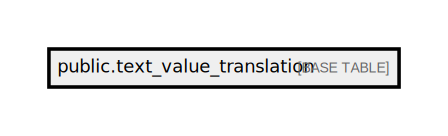

# public.text_value_translation

## Description

## Columns

| Name            | Type                           | Default                                            | Nullable |
| --------------- | ------------------------------ | -------------------------------------------------- | -------- |
| id              | bigint                         | nextval('text_value_translation_id_seq'::regclass) | false    |
| value_txt       | text                           |                                                    | false    |
| result_label_en | text                           |                                                    | false    |
| result_label_vi | text                           |                                                    | false    |
| created_at      | timestamp(0) without time zone |                                                    | true     |
| updated_at      | timestamp(0) without time zone |                                                    | true     |

## Constraints

| Name                                    | Type        | Definition         |
| --------------------------------------- | ----------- | ------------------ |
| text_value_translation_pkey             | PRIMARY KEY | PRIMARY KEY (id)   |
| text_value_translation_value_txt_unique | UNIQUE      | UNIQUE (value_txt) |

## Indexes

| Name                                    | Definition                                                                                                           |
| --------------------------------------- | -------------------------------------------------------------------------------------------------------------------- |
| text_value_translation_pkey             | CREATE UNIQUE INDEX text_value_translation_pkey ON public.text_value_translation USING btree (id)                    |
| text_value_translation_value_txt_unique | CREATE UNIQUE INDEX text_value_translation_value_txt_unique ON public.text_value_translation USING btree (value_txt) |

## Relations

---

> Generated by [tbls](https://github.com/k1LoW/tbls)
