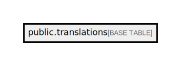

# public.translations

## Description

## Columns

| Name              | Type                           | Default                                  | Nullable |
| ----------------- | ------------------------------ | ---------------------------------------- | -------- |
| id                | bigint                         | nextval('translations_id_seq'::regclass) | false    |
| lang              | varchar(255)                   |                                          | false    |
| content           | json                           |                                          | false    |
| translatable_type | varchar(255)                   |                                          | false    |
| translatable_id   | bigint                         |                                          | false    |
| created_at        | timestamp(0) without time zone |                                          | true     |
| updated_at        | timestamp(0) without time zone |                                          | true     |

## Constraints

| Name                                                       | Type        | Definition                                        |
| ---------------------------------------------------------- | ----------- | ------------------------------------------------- |
| translations_pkey                                          | PRIMARY KEY | PRIMARY KEY (id)                                  |
| translations_lang_translatable_id_translatable_type_unique | UNIQUE      | UNIQUE (lang, translatable_id, translatable_type) |

## Indexes

| Name                                                       | Definition                                                                                                                                                   |
| ---------------------------------------------------------- | ------------------------------------------------------------------------------------------------------------------------------------------------------------ |
| translations_pkey                                          | CREATE UNIQUE INDEX translations_pkey ON public.translations USING btree (id)                                                                                |
| translations_translatable_type_translatable_id_index       | CREATE INDEX translations_translatable_type_translatable_id_index ON public.translations USING btree (translatable_type, translatable_id)                    |
| translations_lang_translatable_id_translatable_type_unique | CREATE UNIQUE INDEX translations_lang_translatable_id_translatable_type_unique ON public.translations USING btree (lang, translatable_id, translatable_type) |

## Relations

---

> Generated by [tbls](https://github.com/k1LoW/tbls)
