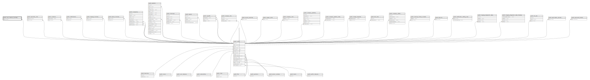

# public.user_medical_facilities

## Description

## Columns

| Name                  | Type                           | Default                                             | Nullable | Parents                         |
| --------------------- | ------------------------------ | --------------------------------------------------- | -------- | ------------------------------- |
| id                    | bigint                         | nextval('user_medical_facilities_id_seq'::regclass) | false    |                                 |
| user_id               | bigint                         |                                                     | false    | [public.users](public.users.md) |
| managing_organization | varchar(255)                   |                                                     | true     |                                 |
| facility_name         | varchar(255)                   |                                                     | true     |                                 |
| facility_address      | text                           |                                                     | true     |                                 |
| created_at            | timestamp(0) without time zone |                                                     | true     |                                 |
| updated_at            | timestamp(0) without time zone |                                                     | true     |                                 |
| deleted_at            | timestamp(0) without time zone |                                                     | true     |                                 |

## Constraints

| Name                                    | Type        | Definition                                 |
| --------------------------------------- | ----------- | ------------------------------------------ |
| user_medical_facilities_user_id_foreign | FOREIGN KEY | FOREIGN KEY (user_id) REFERENCES users(id) |
| user_medical_facilities_pkey            | PRIMARY KEY | PRIMARY KEY (id)                           |

## Indexes

| Name                         | Definition                                                                                          |
| ---------------------------- | --------------------------------------------------------------------------------------------------- |
| user_medical_facilities_pkey | CREATE UNIQUE INDEX user_medical_facilities_pkey ON public.user_medical_facilities USING btree (id) |

## Relations

---

> Generated by [tbls](https://github.com/k1LoW/tbls)
