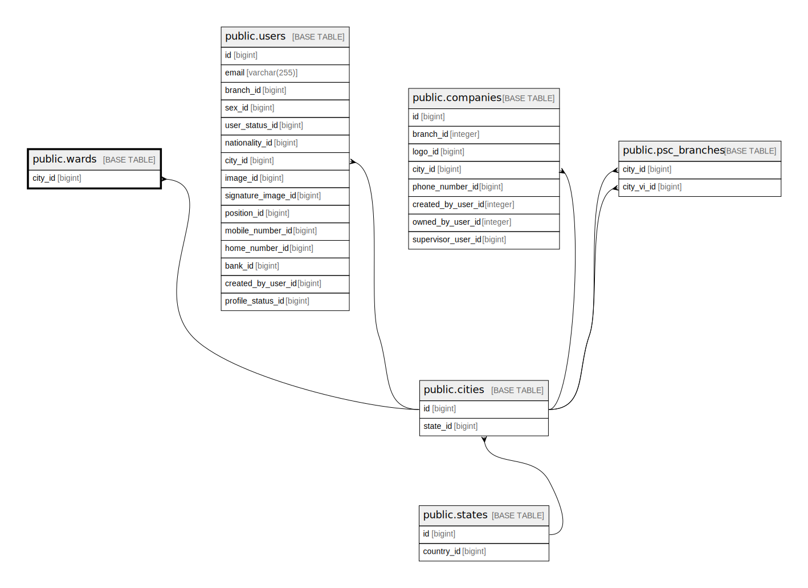

# public.wards

## Description

## Columns

| Name    | Type         | Default                           | Nullable | Parents                           |
| ------- | ------------ | --------------------------------- | -------- | --------------------------------- |
| id      | bigint       | nextval('wards_id_seq'::regclass) | false    |                                   |
| city_id | bigint       |                                   | false    | [public.cities](public.cities.md) |
| name    | varchar(255) |                                   | false    |                                   |

## Constraints

| Name                  | Type        | Definition                                                    |
| --------------------- | ----------- | ------------------------------------------------------------- |
| wards_city_id_foreign | FOREIGN KEY | FOREIGN KEY (city_id) REFERENCES cities(id) ON DELETE CASCADE |
| wards_pkey            | PRIMARY KEY | PRIMARY KEY (id)                                              |

## Indexes

| Name       | Definition                                                      |
| ---------- | --------------------------------------------------------------- |
| wards_pkey | CREATE UNIQUE INDEX wards_pkey ON public.wards USING btree (id) |

## Relations

---

> Generated by [tbls](https://github.com/k1LoW/tbls)
