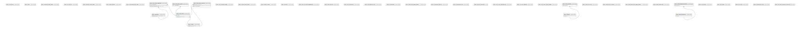

# spc--lis--be

## Description

Production LIS Database

## Tables

| Name                                                                                  | Columns | Comment | Type       |
| ------------------------------------------------------------------------------------- | ------- | ------- | ---------- |
| [public.migrations](public.migrations.md)                                             | 3       |         | BASE TABLE |
| [public.users](public.users.md)                                                       | 8       |         | BASE TABLE |
| [public.password_reset_tokens](public.password_reset_tokens.md)                       | 3       |         | BASE TABLE |
| [public.failed_jobs](public.failed_jobs.md)                                           | 7       |         | BASE TABLE |
| [public.personal_access_tokens](public.personal_access_tokens.md)                     | 10      |         | BASE TABLE |
| [public.order_samples](public.order_samples.md)                                       | 38      |         | BASE TABLE |
| [public.lab_machine_test_codes](public.lab_machine_test_codes.md)                     | 9       |         | BASE TABLE |
| [public.approvers](public.approvers.md)                                               | 4       |         | BASE TABLE |
| [public.orders](public.orders.md)                                                     | 24      |         | BASE TABLE |
| [public.test_results](public.test_results.md)                                         | 78      |         | BASE TABLE |
| [public.test_result_audits](public.test_result_audits.md)                             | 9       |         | BASE TABLE |
| [public.test_results_approvers](public.test_results_approvers.md)                     | 6       |         | BASE TABLE |
| [public.test_reference_ranges](public.test_reference_ranges.md)                       | 17      |         | BASE TABLE |
| [public.sample_type_imports](public.sample_type_imports.md)                           | 7       |         | BASE TABLE |
| [public.sample_runners](public.sample_runners.md)                                     | 5       |         | BASE TABLE |
| [public.sections](public.sections.md)                                                 | 7       |         | BASE TABLE |
| [public.order_result_services](public.order_result_services.md)                       | 14      |         | BASE TABLE |
| [public.test_calculation_dependencies](public.test_calculation_dependencies.md)       | 10      |         | BASE TABLE |
| [public.test_formulas](public.test_formulas.md)                                       | 10      |         | BASE TABLE |
| [public.test_conversions](public.test_conversions.md)                                 | 10      |         | BASE TABLE |
| [public.auto_approval_tests](public.auto_approval_tests.md)                           | 5       |         | BASE TABLE |
| [public.attachments](public.attachments.md)                                           | 13      |         | BASE TABLE |
| [public.batch_async_queue_producer](public.batch_async_queue_producer.md)             | 7       |         | BASE TABLE |
| [public.workorders_devices](public.workorders_devices.md)                             | 7       |         | BASE TABLE |
| [public.replacement_tests](public.replacement_tests.md)                               | 6       |         | BASE TABLE |
| [public.pg_stat_statements](public.pg_stat_statements.md)                             | 23      |         | VIEW       |
| [public.int_client_configurations](public.int_client_configurations.md)               | 10      |         | BASE TABLE |
| [public.int_test_mappings](public.int_test_mappings.md)                               | 16      |         | BASE TABLE |
| [public.test_result_status_changes](public.test_result_status_changes.md)             | 13      |         | BASE TABLE |
| [public.batches](public.batches.md)                                                   | 15      |         | BASE TABLE |
| [public.batch_samples](public.batch_samples.md)                                       | 5       |         | BASE TABLE |
| [public.order_recollects](public.order_recollects.md)                                 | 8       |         | BASE TABLE |
| [public.sample_print_configs](public.sample_print_configs.md)                         | 5       |         | BASE TABLE |
| [public.batch_async_audit_queue_producer](public.batch_async_audit_queue_producer.md) | 7       |         | BASE TABLE |
| [public.order_monitorings](public.order_monitorings.md)                               | 9       |         | BASE TABLE |
| [public.batches_outsource](public.batches_outsource.md)                               | 12      |         | BASE TABLE |
| [public.batch_outsource_samples](public.batch_outsource_samples.md)                   | 5       |         | BASE TABLE |
| [public.tat_configs](public.tat_configs.md)                                           | 10      |         | BASE TABLE |
| [public.tat_stands](public.tat_stands.md)                                             | 10      |         | BASE TABLE |
| [public.tat_alerts](public.tat_alerts.md)                                             | 22      |         | BASE TABLE |
| [public.disabled_tat_alerts](public.disabled_tat_alerts.md)                           | 6       |         | BASE TABLE |
| [public.tat_alerts_summary_histories](public.tat_alerts_summary_histories.md)         | 7       |         | BASE TABLE |

## Stored procedures and functions

| Name                            | ReturnType | Arguments                                                                                                                                                                                                                                                                                                                                                                                                                                                                                                                                                                                                                                                              | Type     |
| ------------------------------- | ---------- | ---------------------------------------------------------------------------------------------------------------------------------------------------------------------------------------------------------------------------------------------------------------------------------------------------------------------------------------------------------------------------------------------------------------------------------------------------------------------------------------------------------------------------------------------------------------------------------------------------------------------------------------------------------------------- | -------- |
| public.pg_stat_statements       | record     | showtext boolean, OUT userid oid, OUT dbid oid, OUT queryid bigint, OUT query text, OUT calls bigint, OUT total_time double precision, OUT min_time double precision, OUT max_time double precision, OUT mean_time double precision, OUT stddev_time double precision, OUT rows bigint, OUT shared_blks_hit bigint, OUT shared_blks_read bigint, OUT shared_blks_dirtied bigint, OUT shared_blks_written bigint, OUT local_blks_hit bigint, OUT local_blks_read bigint, OUT local_blks_dirtied bigint, OUT local_blks_written bigint, OUT temp_blks_read bigint, OUT temp_blks_written bigint, OUT blk_read_time double precision, OUT blk_write_time double precision | FUNCTION |
| public.pg_stat_statements_reset | void       |                                                                                                                                                                                                                                                                                                                                                                                                                                                                                                                                                                                                                                                                        | FUNCTION |

## Relations

---

> Generated by [tbls](https://github.com/k1LoW/tbls)
