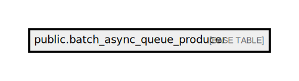

# public.batch_async_queue_producer

## Description

## Columns

| Name            | Type                           | Default                                                | Nullable |
| --------------- | ------------------------------ | ------------------------------------------------------ | -------- |
| id              | bigint                         | nextval('batch_async_queue_producer_id_seq'::regclass) | false    |
| topic           | text                           |                                                        | false    |
| message_key     | text                           |                                                        | true     |
| message_headers | json                           |                                                        | true     |
| message_payload | json                           |                                                        | false    |
| created_at      | timestamp(0) without time zone |                                                        | true     |
| updated_at      | timestamp(0) without time zone |                                                        | true     |

## Constraints

| Name                            | Type        | Definition       |
| ------------------------------- | ----------- | ---------------- |
| batch_async_queue_producer_pkey | PRIMARY KEY | PRIMARY KEY (id) |

## Indexes

| Name                            | Definition                                                                                                |
| ------------------------------- | --------------------------------------------------------------------------------------------------------- |
| batch_async_queue_producer_pkey | CREATE UNIQUE INDEX batch_async_queue_producer_pkey ON public.batch_async_queue_producer USING btree (id) |

## Relations

---

> Generated by [tbls](https://github.com/k1LoW/tbls)
