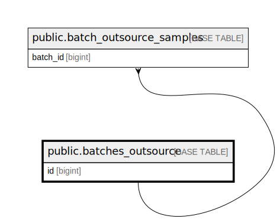

# public.batches_outsource

## Description

## Columns

| Name           | Type                           | Default                                       | Nullable | Children                                                            |
| -------------- | ------------------------------ | --------------------------------------------- | -------- | ------------------------------------------------------------------- |
| id             | bigint                         | nextval('batches_outsource_id_seq'::regclass) | false    | [public.batch_outsource_samples](public.batch_outsource_samples.md) |
| batch_name     | varchar(255)                   |                                               | false    |                                                                     |
| batch_code     | varchar(255)                   |                                               | false    |                                                                     |
| laboratory     | varchar(255)                   |                                               | false    |                                                                     |
| status         | varchar(255)                   |                                               | false    |                                                                     |
| created_by     | varchar(255)                   |                                               | false    |                                                                     |
| transferred_at | timestamp(0) without time zone |                                               | true     |                                                                     |
| cancelled_at   | timestamp(0) without time zone |                                               | true     |                                                                     |
| completed_at   | timestamp(0) without time zone |                                               | true     |                                                                     |
| total_sample   | integer                        | 0                                             | false    |                                                                     |
| created_at     | timestamp(0) without time zone |                                               | true     |                                                                     |
| updated_at     | timestamp(0) without time zone |                                               | true     |                                                                     |

## Constraints

| Name                                | Type        | Definition          |
| ----------------------------------- | ----------- | ------------------- |
| batches_outsource_pkey              | PRIMARY KEY | PRIMARY KEY (id)    |
| batches_outsource_batch_name_unique | UNIQUE      | UNIQUE (batch_name) |
| batches_outsource_batch_code_unique | UNIQUE      | UNIQUE (batch_code) |

## Indexes

| Name                                | Definition                                                                                                   |
| ----------------------------------- | ------------------------------------------------------------------------------------------------------------ |
| batches_outsource_pkey              | CREATE UNIQUE INDEX batches_outsource_pkey ON public.batches_outsource USING btree (id)                      |
| batches_outsource_batch_name_unique | CREATE UNIQUE INDEX batches_outsource_batch_name_unique ON public.batches_outsource USING btree (batch_name) |
| batches_outsource_batch_code_unique | CREATE UNIQUE INDEX batches_outsource_batch_code_unique ON public.batches_outsource USING btree (batch_code) |

## Relations

---

> Generated by [tbls](https://github.com/k1LoW/tbls)
