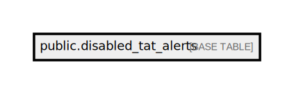

# public.disabled_tat_alerts

## Description

## Columns

| Name        | Type                           | Default                                         | Nullable |
| ----------- | ------------------------------ | ----------------------------------------------- | -------- |
| id          | bigint                         | nextval('disabled_tat_alerts_id_seq'::regclass) | false    |
| order_id    | varchar(50)                    |                                                 | false    |
| disabled_by | varchar(255)                   |                                                 | false    |
| disabled_at | timestamp(0) without time zone |                                                 | false    |
| created_at  | timestamp(0) without time zone |                                                 | true     |
| updated_at  | timestamp(0) without time zone |                                                 | true     |

## Constraints

| Name                     | Type        | Definition       |
| ------------------------ | ----------- | ---------------- |
| disabled_tat_alerts_pkey | PRIMARY KEY | PRIMARY KEY (id) |

## Indexes

| Name                               | Definition                                                                                           |
| ---------------------------------- | ---------------------------------------------------------------------------------------------------- |
| disabled_tat_alerts_pkey           | CREATE UNIQUE INDEX disabled_tat_alerts_pkey ON public.disabled_tat_alerts USING btree (id)          |
| disabled_tat_alerts_order_id_index | CREATE INDEX disabled_tat_alerts_order_id_index ON public.disabled_tat_alerts USING btree (order_id) |

## Relations

---

> Generated by [tbls](https://github.com/k1LoW/tbls)
