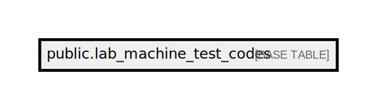

# public.lab_machine_test_codes

## Description

## Columns

| Name                  | Type                           | Default                                            | Nullable | Comment                                        |
| --------------------- | ------------------------------ | -------------------------------------------------- | -------- | ---------------------------------------------- |
| id                    | bigint                         | nextval('lab_machine_test_codes_id_seq'::regclass) | false    |                                                |
| device_code           | varchar(50)                    |                                                    | false    | Code identifying the lab machine               |
| device_name           | varchar(50)                    |                                                    | false    | Name of the lab machine                        |
| lab_machine_test_code | varchar(50)                    |                                                    | false    | Test code specific to the lab machine          |
| lis_test_code         | varchar(50)                    |                                                    | false    | Test code in the Laboratory Information System |
| is_active             | boolean                        |                                                    | false    | Status indicating if the test code is active   |
| created_at            | timestamp(0) without time zone |                                                    | true     |                                                |
| updated_at            | timestamp(0) without time zone |                                                    | true     |                                                |
| device_search_code    | varchar(20)                    |                                                    | true     | Device code for search                         |

## Constraints

| Name                        | Type        | Definition       |
| --------------------------- | ----------- | ---------------- |
| lab_machine_test_codes_pkey | PRIMARY KEY | PRIMARY KEY (id) |

## Indexes

| Name                                            | Definition                                                                                                                     |
| ----------------------------------------------- | ------------------------------------------------------------------------------------------------------------------------------ |
| lab_machine_test_codes_pkey                     | CREATE UNIQUE INDEX lab_machine_test_codes_pkey ON public.lab_machine_test_codes USING btree (id)                              |
| lab_machine_test_codes_lis_test_code_index      | CREATE INDEX lab_machine_test_codes_lis_test_code_index ON public.lab_machine_test_codes USING btree (lis_test_code)           |
| lab_machine_test_codes_device_search_code_index | CREATE INDEX lab_machine_test_codes_device_search_code_index ON public.lab_machine_test_codes USING btree (device_search_code) |

## Relations

---

> Generated by [tbls](https://github.com/k1LoW/tbls)
