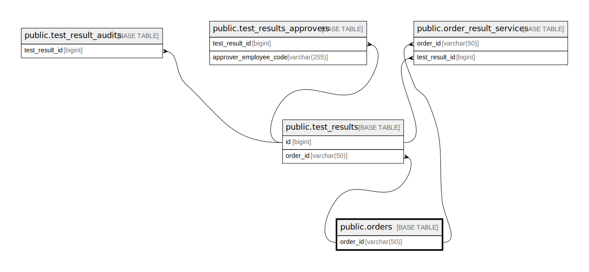

# public.orders

## Description

## Columns

| Name                         | Type                           | Default | Nullable | Children                                                                                                      |
| ---------------------------- | ------------------------------ | ------- | -------- | ------------------------------------------------------------------------------------------------------------- |
| order_id                     | varchar(50)                    |         | false    | [public.test_results](public.test_results.md) [public.order_result_services](public.order_result_services.md) |
| account_code                 | varchar(50)                    |         | false    |                                                                                                               |
| patient_id                   | varchar(50)                    |         | false    |                                                                                                               |
| patient_name                 | varchar(100)                   |         | false    |                                                                                                               |
| patient_gender               | varchar(50)                    |         | false    |                                                                                                               |
| patient_dob                  | timestamp(0) without time zone |         | false    |                                                                                                               |
| created_at                   | timestamp(0) without time zone |         | true     |                                                                                                               |
| updated_at                   | timestamp(0) without time zone |         | true     |                                                                                                               |
| register_location            | varchar(50)                    |         | true     |                                                                                                               |
| ordered_date                 | timestamp(0) without time zone |         | true     |                                                                                                               |
| recollecting_flag            | boolean                        | false   | false    |                                                                                                               |
| patient_mobile_number        | varchar(20)                    |         | true     |                                                                                                               |
| patient_info                 | json                           |         | true     |                                                                                                               |
| patient_visit_info           | json                           |         | true     |                                                                                                               |
| customer_segment_id          | bigint                         |         | true     |                                                                                                               |
| is_approved                  | boolean                        | false   | false    |                                                                                                               |
| source_type                  | varchar(255)                   |         | true     |                                                                                                               |
| prevent_update_to            | timestamp(0) without time zone |         | true     |                                                                                                               |
| status                       | varchar(255)                   |         | true     |                                                                                                               |
| order_test_codes             | json                           |         | true     |                                                                                                               |
| cancel_test_codes            | json                           |         | true     |                                                                                                               |
| clone_order_id               | varchar(50)                    |         | true     |                                                                                                               |
| patient_info_last_updated_at | timestamp(0) without time zone |         | true     |                                                                                                               |
| stat                         | boolean                        |         | true     |                                                                                                               |

## Constraints

| Name        | Type        | Definition             |
| ----------- | ----------- | ---------------------- |
| orders_pkey | PRIMARY KEY | PRIMARY KEY (order_id) |

## Indexes

| Name                               | Definition                                                                                                                                 |
| ---------------------------------- | ------------------------------------------------------------------------------------------------------------------------------------------ |
| orders_pkey                        | CREATE UNIQUE INDEX orders_pkey ON public.orders USING btree (order_id)                                                                    |
| orders_ordered_date_index          | CREATE INDEX orders_ordered_date_index ON public.orders USING btree (ordered_date)                                                         |
| order_id_index                     | CREATE INDEX order_id_index ON public.orders USING btree (order_id)                                                                        |
| order_source_type_index            | CREATE INDEX order_source_type_index ON public.orders USING btree (source_type)                                                            |
| pending_list_order_source_type_idx | CREATE INDEX pending_list_order_source_type_idx ON public.orders USING btree (order_id, source_type) WHERE (source_type IS NOT NULL)       |
| count_todo_o_idx                   | CREATE INDEX count_todo_o_idx ON public.orders USING btree (ordered_date) INCLUDE (order_id) WHERE ((source_type)::text = 'LIS_API'::text) |

## Relations

---

> Generated by [tbls](https://github.com/k1LoW/tbls)
