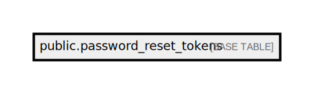

# public.password_reset_tokens

## Description

## Columns

| Name       | Type                           | Default | Nullable |
| ---------- | ------------------------------ | ------- | -------- |
| email      | varchar(255)                   |         | false    |
| token      | varchar(255)                   |         | false    |
| created_at | timestamp(0) without time zone |         | true     |

## Constraints

| Name                       | Type        | Definition          |
| -------------------------- | ----------- | ------------------- |
| password_reset_tokens_pkey | PRIMARY KEY | PRIMARY KEY (email) |

## Indexes

| Name                       | Definition                                                                                         |
| -------------------------- | -------------------------------------------------------------------------------------------------- |
| password_reset_tokens_pkey | CREATE UNIQUE INDEX password_reset_tokens_pkey ON public.password_reset_tokens USING btree (email) |

## Relations

---

> Generated by [tbls](https://github.com/k1LoW/tbls)
