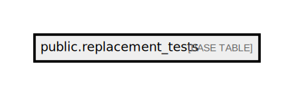

# public.replacement_tests

## Description

## Columns

| Name                  | Type                           | Default                                       | Nullable |
| --------------------- | ------------------------------ | --------------------------------------------- | -------- |
| id                    | bigint                         | nextval('replacement_tests_id_seq'::regclass) | false    |
| test_code             | varchar(50)                    |                                               | false    |
| replacement_test_code | varchar(50)                    |                                               | false    |
| test_value            | varchar(255)                   |                                               | false    |
| created_at            | timestamp(0) without time zone |                                               | true     |
| updated_at            | timestamp(0) without time zone |                                               | true     |

## Constraints

| Name                   | Type        | Definition       |
| ---------------------- | ----------- | ---------------- |
| replacement_tests_pkey | PRIMARY KEY | PRIMARY KEY (id) |

## Indexes

| Name                              | Definition                                                                                         |
| --------------------------------- | -------------------------------------------------------------------------------------------------- |
| replacement_tests_pkey            | CREATE UNIQUE INDEX replacement_tests_pkey ON public.replacement_tests USING btree (id)            |
| replacement_tests_test_code_index | CREATE INDEX replacement_tests_test_code_index ON public.replacement_tests USING btree (test_code) |

## Relations

---

> Generated by [tbls](https://github.com/k1LoW/tbls)
