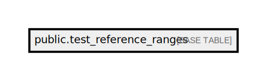

# public.test_reference_ranges

## Description

## Columns

| Name               | Type         | Default                                           | Nullable | Comment                                                                       |
| ------------------ | ------------ | ------------------------------------------------- | -------- | ----------------------------------------------------------------------------- |
| id                 | bigint       | nextval('test_reference_ranges_id_seq'::regclass) | false    |                                                                               |
| test_code          | varchar(255) |                                                   | false    | Mandatory unique identifier for the test                                      |
| value_type         | varchar(50)  |                                                   | false    | Mandatory: Indicates if the value is numeric or text                          |
| gender             | varchar(50)  |                                                   | false    | Mandatory: Specifies the gender, [Male, Female, Both]                         |
| age_type           | varchar(255) | 'days'::character varying                         | false    | Mandatory: Specifies the age type. Default: days                              |
| age_min            | integer      |                                                   | false    | Mandatory: Specifies the minimum age range in days                            |
| age_max            | integer      |                                                   | false    | Mandatory: Specifies the maximum age range in days                            |
| value_opr          | varchar(255) |                                                   | false    |                                                                               |
| value_min          | varchar(255) |                                                   | true     | Mandatory: Specifies the minimum value                                        |
| value_max          | varchar(255) |                                                   | true     | Mandatory: Specifies the maximum value                                        |
| unit               | varchar(255) |                                                   | true     | Optional: Specifies the unit of measurement                                   |
| range_type         | varchar(255) |                                                   | false    | Mandatory: Specifies the range type (normal, abnormal, critical, print_range) |
| auto_authorized    | boolean      |                                                   | false    | Mandatory: Specifies if the range is auto-authorized or not (true, false)     |
| result_label_en    | varchar(255) |                                                   | true     | For print_range type, the label to be displayed in the result                 |
| result_label_vi    | varchar(255) |                                                   | true     | For print_range type, the label to be displayed in the result                 |
| result_label_order | integer      |                                                   | true     | For print_range type, the label order to be displayed in the result           |
| medical_remark     | boolean      | false                                             | false    |                                                                               |

## Constraints

| Name                       | Type        | Definition       |
| -------------------------- | ----------- | ---------------- |
| test_reference_ranges_pkey | PRIMARY KEY | PRIMARY KEY (id) |

## Indexes

| Name                                  | Definition                                                                                                 |
| ------------------------------------- | ---------------------------------------------------------------------------------------------------------- |
| test_reference_ranges_pkey            | CREATE UNIQUE INDEX test_reference_ranges_pkey ON public.test_reference_ranges USING btree (id)            |
| test_reference_ranges_test_code_index | CREATE INDEX test_reference_ranges_test_code_index ON public.test_reference_ranges USING btree (test_code) |

## Relations

---

> Generated by [tbls](https://github.com/k1LoW/tbls)
