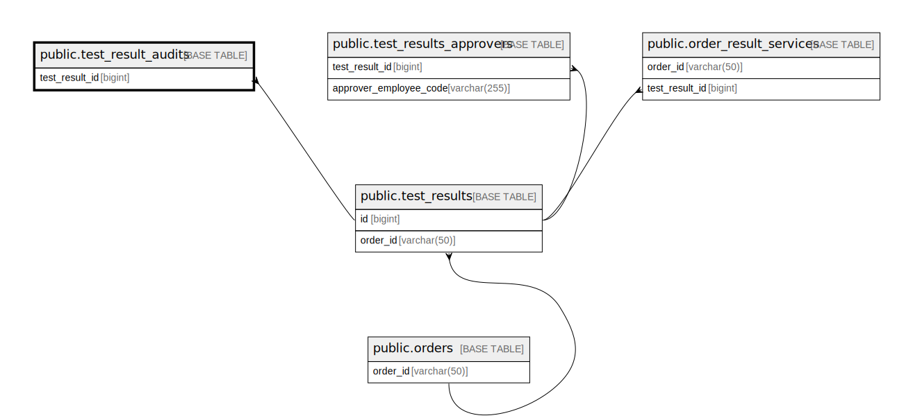

# public.test_result_audits

## Description

## Columns

| Name           | Type                           | Default                                        | Nullable | Parents                                       | Comment                                      |
| -------------- | ------------------------------ | ---------------------------------------------- | -------- | --------------------------------------------- | -------------------------------------------- |
| id             | bigint                         | nextval('test_result_audits_id_seq'::regclass) | false    |                                               |                                              |
| test_result_id | bigint                         |                                                | false    | [public.test_results](public.test_results.md) |                                              |
| before         | json                           |                                                | false    |                                               | State of the test result before update       |
| after          | json                           |                                                | false    |                                               | State of the test result after update        |
| created_by     | varchar(255)                   |                                                | false    |                                               | Identifier of the user who created the audit |
| before_version | varchar(50)                    |                                                | false    |                                               | Version of the test result before update     |
| after_version  | varchar(50)                    |                                                | false    |                                               | Version of the test result after update      |
| created_at     | timestamp(0) without time zone |                                                | true     |                                               |                                              |
| updated_at     | timestamp(0) without time zone |                                                | true     |                                               |                                              |

## Constraints

| Name                                      | Type        | Definition                                                                 |
| ----------------------------------------- | ----------- | -------------------------------------------------------------------------- |
| test_result_audits_test_result_id_foreign | FOREIGN KEY | FOREIGN KEY (test_result_id) REFERENCES test_results(id) ON DELETE CASCADE |
| test_result_audits_pkey                   | PRIMARY KEY | PRIMARY KEY (id)                                                           |

## Indexes

| Name                        | Definition                                                                                         |
| --------------------------- | -------------------------------------------------------------------------------------------------- |
| test_result_audits_pkey     | CREATE UNIQUE INDEX test_result_audits_pkey ON public.test_result_audits USING btree (id)          |
| idx_tr_audit_test_result_id | CREATE INDEX idx_tr_audit_test_result_id ON public.test_result_audits USING btree (test_result_id) |

## Relations

---

> Generated by [tbls](https://github.com/k1LoW/tbls)
