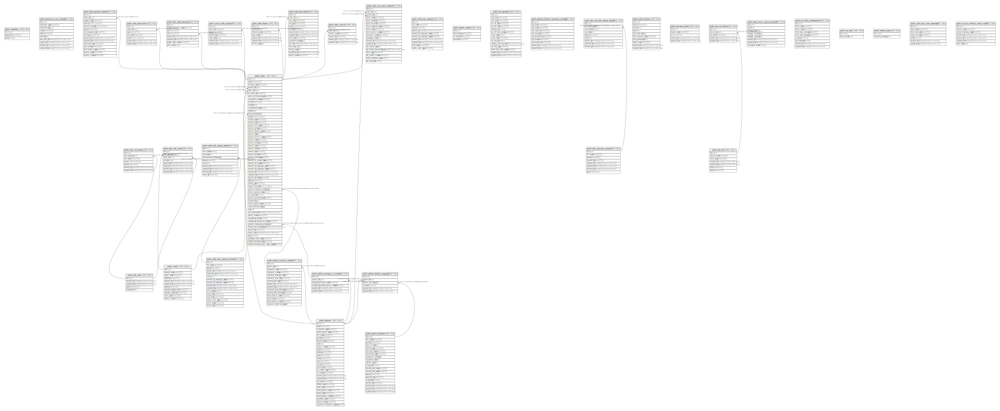

# spc--pos--be

## Tables

| Name | Columns | Comment | Type |
| ---- | ------- | ------- | ---- |
| [public.migrations](public.migrations.md) | 3 |  | BASE TABLE |
| [public.personal_access_tokens](public.personal_access_tokens.md) | 10 |  | BASE TABLE |
| [public.patients](public.patients.md) | 29 |  | BASE TABLE |
| [public.clients](public.clients.md) | 11 |  | BASE TABLE |
| [public.order_bulk_uploads](public.order_bulk_uploads.md) | 10 |  | BASE TABLE |
| [public.orders](public.orders.md) | 58 |  | BASE TABLE |
| [public.order_bulk_upload_archives](public.order_bulk_upload_archives.md) | 16 |  | BASE TABLE |
| [public.order_details](public.order_details.md) | 7 |  | BASE TABLE |
| [public.order_test_details](public.order_test_details.md) | 15 |  | BASE TABLE |
| [public.order_invoices](public.order_invoices.md) | 6 |  | BASE TABLE |
| [public.rate_cards](public.rate_cards.md) | 5 |  | BASE TABLE |
| [public.order_payment_details](public.order_payment_details.md) | 15 |  | BASE TABLE |
| [public.logistic_details](public.logistic_details.md) | 4 |  | BASE TABLE |
| [public.tat_standards](public.tat_standards.md) | 15 |  | BASE TABLE |
| [public.rate_card_details](public.rate_card_details.md) | 7 |  | BASE TABLE |
| [public.rate_card_clients](public.rate_card_clients.md) | 8 |  | BASE TABLE |
| [public.patient_historical_questions_answers](public.patient_historical_questions_answers.md) | 10 |  | BASE TABLE |
| [public.rate_card_bulk_uploads](public.rate_card_bulk_uploads.md) | 8 |  | BASE TABLE |
| [public.rate_card_bulk_upload_details](public.rate_card_bulk_upload_details.md) | 9 |  | BASE TABLE |
| [public.audit_histories](public.audit_histories.md) | 10 |  | BASE TABLE |
| [public.patient_insurance_details](public.patient_insurance_details.md) | 15 |  | BASE TABLE |
| [public.order_vat_invoice_details](public.order_vat_invoice_details.md) | 19 |  | BASE TABLE |
| [public.order_transactions](public.order_transactions.md) | 7 |  | BASE TABLE |
| [public.order_bulk_upload_details](public.order_bulk_upload_details.md) | 10 |  | BASE TABLE |
| [public.bulk_order_barcodes](public.bulk_order_barcodes.md) | 8 |  | BASE TABLE |
| [public.barcode_printers](public.barcode_printers.md) | 5 |  | BASE TABLE |
| [public.test_sets](public.test_sets.md) | 7 |  | BASE TABLE |
| [public.batch_async_queue_producer](public.batch_async_queue_producer.md) | 8 |  | BASE TABLE |
| [public.patient_identities](public.patient_identities.md) | 20 |  | BASE TABLE |
| [public.patient_identity_mappings](public.patient_identity_mappings.md) | 6 |  | BASE TABLE |
| [public.int_client_configurations](public.int_client_configurations.md) | 9 |  | BASE TABLE |
| [public.test_set_details](public.test_set_details.md) | 5 |  | BASE TABLE |
| [public.patient_emergency_contacts](public.patient_emergency_contacts.md) | 6 |  | BASE TABLE |
| [public.my_table](public.my_table.md) | 2 |  | BASE TABLE |
| [public.medical_data](public.medical_data.md) | 2 |  | BASE TABLE |
| [public.client_test_code_mappings](public.client_test_code_mappings.md) | 7 |  | BASE TABLE |
| [public.invoice_whitelist_credit_clients](public.invoice_whitelist_credit_clients.md) | 7 |  | BASE TABLE |
| [public.cancel_order_requests](public.cancel_order_requests.md) | 7 |  | BASE TABLE |

## Relations

---

> Generated by [tbls](https://github.com/k1LoW/tbls)
