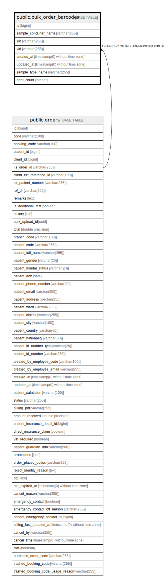

# public.bulk_order_barcodes

## Description

## Columns

| Name | Type | Default | Nullable | Children | Parents | Comment |
| ---- | ---- | ------- | -------- | -------- | ------- | ------- |
| id | bigint | nextval('bulk_order_barcodes_id_seq'::regclass) | false |  |  |  |
| sample_container_name | varchar(255) |  | false |  |  |  |
| sid | varchar(255) |  | false |  |  |  |
| vid | varchar(255) |  | false |  | [public.orders](public.orders.md) |  |
| created_at | timestamp(0) without time zone |  | true |  |  |  |
| updated_at | timestamp(0) without time zone |  | true |  |  |  |
| sample_type_name | varchar(255) |  | false |  |  |  |
| print_count | integer | 0 | false |  |  |  |

## Constraints

| Name | Type | Definition |
| ---- | ---- | ---------- |
| bulk_order_barcodes_vid_foreign | FOREIGN KEY | FOREIGN KEY (vid) REFERENCES orders(lis_order_id) |
| bulk_order_barcodes_pkey | PRIMARY KEY | PRIMARY KEY (id) |
| vid | UNIQUE | UNIQUE (sid) |

## Indexes

| Name | Definition |
| ---- | ---------- |
| bulk_order_barcodes_pkey | CREATE UNIQUE INDEX bulk_order_barcodes_pkey ON public.bulk_order_barcodes USING btree (id) |
| vid | CREATE UNIQUE INDEX vid ON public.bulk_order_barcodes USING btree (sid) |

## Relations

---

> Generated by [tbls](https://github.com/k1LoW/tbls)
