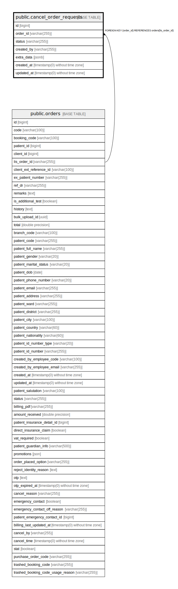

# public.cancel_order_requests

## Description

## Columns

| Name | Type | Default | Nullable | Children | Parents | Comment |
| ---- | ---- | ------- | -------- | -------- | ------- | ------- |
| id | bigint | nextval('cancel_order_requests_id_seq'::regclass) | false |  |  |  |
| order_id | varchar(255) |  | false |  | [public.orders](public.orders.md) |  |
| status | varchar(255) |  | false |  |  |  |
| created_by | varchar(255) |  | false |  |  |  |
| extra_data | jsonb |  | true |  |  |  |
| created_at | timestamp(0) without time zone |  | true |  |  |  |
| updated_at | timestamp(0) without time zone |  | true |  |  |  |

## Constraints

| Name | Type | Definition |
| ---- | ---- | ---------- |
| cancel_order_requests_order_id_foreign | FOREIGN KEY | FOREIGN KEY (order_id) REFERENCES orders(lis_order_id) |
| cancel_order_requests_pkey | PRIMARY KEY | PRIMARY KEY (id) |

## Indexes

| Name | Definition |
| ---- | ---------- |
| cancel_order_requests_pkey | CREATE UNIQUE INDEX cancel_order_requests_pkey ON public.cancel_order_requests USING btree (id) |

## Relations

---

> Generated by [tbls](https://github.com/k1LoW/tbls)
