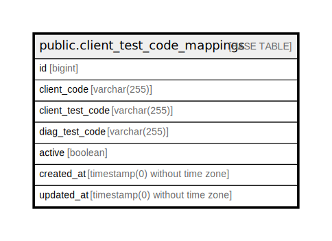

# public.client_test_code_mappings

## Description

## Columns

| Name | Type | Default | Nullable | Children | Parents | Comment |
| ---- | ---- | ------- | -------- | -------- | ------- | ------- |
| id | bigint | nextval('client_test_code_mappings_id_seq'::regclass) | false |  |  |  |
| client_code | varchar(255) |  | false |  |  |  |
| client_test_code | varchar(255) |  | false |  |  |  |
| diag_test_code | varchar(255) |  | false |  |  |  |
| active | boolean |  | false |  |  |  |
| created_at | timestamp(0) without time zone |  | true |  |  |  |
| updated_at | timestamp(0) without time zone |  | true |  |  |  |

## Constraints

| Name | Type | Definition |
| ---- | ---- | ---------- |
| client_test_code_mappings_pkey | PRIMARY KEY | PRIMARY KEY (id) |
| client_test_code_mappings_client_code_client_test_code_unique | UNIQUE | UNIQUE (client_code, client_test_code) |

## Indexes

| Name | Definition |
| ---- | ---------- |
| client_test_code_mappings_pkey | CREATE UNIQUE INDEX client_test_code_mappings_pkey ON public.client_test_code_mappings USING btree (id) |
| client_test_code_mappings_client_code_client_test_code_unique | CREATE UNIQUE INDEX client_test_code_mappings_client_code_client_test_code_unique ON public.client_test_code_mappings USING btree (client_code, client_test_code) |

## Relations

---

> Generated by [tbls](https://github.com/k1LoW/tbls)
