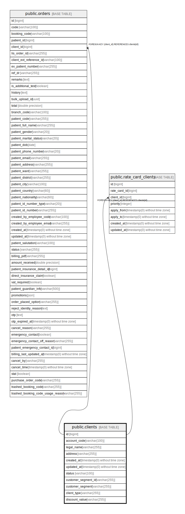

# public.clients

## Description

## Columns

| Name | Type | Default | Nullable | Children | Parents | Comment |
| ---- | ---- | ------- | -------- | -------- | ------- | ------- |
| id | bigint | nextval('clients_id_seq'::regclass) | false | [public.orders](public.orders.md) [public.rate_card_clients](public.rate_card_clients.md) |  |  |
| account_code | varchar(100) |  | false |  |  |  |
| legal_name | varchar(255) |  | false |  |  |  |
| address | varchar(255) |  | true |  |  |  |
| created_at | timestamp(0) without time zone |  | true |  |  |  |
| updated_at | timestamp(0) without time zone |  | true |  |  |  |
| status | varchar(100) | 'active'::character varying | false |  |  |  |
| customer_segment_id | varchar(255) |  | true |  |  |  |
| customer_segment | varchar(255) |  | true |  |  |  |
| client_type | varchar(255) | 'Cash client'::character varying | false |  |  |  |
| discount_value | varchar(255) |  | true |  |  |  |

## Constraints

| Name | Type | Definition |
| ---- | ---- | ---------- |
| clients_pkey | PRIMARY KEY | PRIMARY KEY (id) |
| clients_account_code_unique | UNIQUE | UNIQUE (account_code) |

## Indexes

| Name | Definition |
| ---- | ---------- |
| clients_pkey | CREATE UNIQUE INDEX clients_pkey ON public.clients USING btree (id) |
| clients_account_code_unique | CREATE UNIQUE INDEX clients_account_code_unique ON public.clients USING btree (account_code) |

## Relations

---

> Generated by [tbls](https://github.com/k1LoW/tbls)
