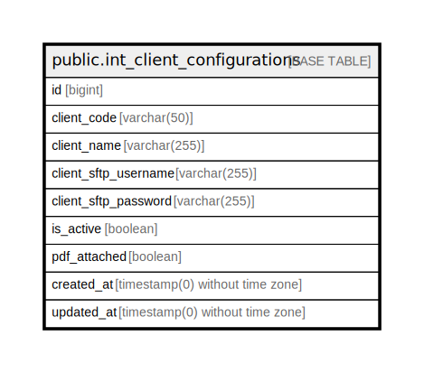

# public.int_client_configurations

## Description

## Columns

| Name | Type | Default | Nullable | Children | Parents | Comment |
| ---- | ---- | ------- | -------- | -------- | ------- | ------- |
| id | bigint | nextval('int_client_configurations_id_seq'::regclass) | false |  |  |  |
| client_code | varchar(50) |  | false |  |  |  |
| client_name | varchar(255) |  | true |  |  |  |
| client_sftp_username | varchar(255) |  | false |  |  |  |
| client_sftp_password | varchar(255) |  | false |  |  |  |
| is_active | boolean | true | false |  |  |  |
| pdf_attached | boolean | false | false |  |  |  |
| created_at | timestamp(0) without time zone |  | true |  |  |  |
| updated_at | timestamp(0) without time zone |  | true |  |  |  |

## Constraints

| Name | Type | Definition |
| ---- | ---- | ---------- |
| int_client_configurations_pkey | PRIMARY KEY | PRIMARY KEY (id) |
| int_client_configurations_client_code_unique | UNIQUE | UNIQUE (client_code) |

## Indexes

| Name | Definition |
| ---- | ---------- |
| int_client_configurations_pkey | CREATE UNIQUE INDEX int_client_configurations_pkey ON public.int_client_configurations USING btree (id) |
| int_client_configurations_client_code_unique | CREATE UNIQUE INDEX int_client_configurations_client_code_unique ON public.int_client_configurations USING btree (client_code) |
| client_sftp_username | CREATE INDEX client_sftp_username ON public.int_client_configurations USING btree (client_sftp_username) |
| client_sftp_password | CREATE INDEX client_sftp_password ON public.int_client_configurations USING btree (client_sftp_password) |
| is_active | CREATE INDEX is_active ON public.int_client_configurations USING btree (is_active) |
| pdf_attached | CREATE INDEX pdf_attached ON public.int_client_configurations USING btree (pdf_attached) |

## Relations

---

> Generated by [tbls](https://github.com/k1LoW/tbls)
