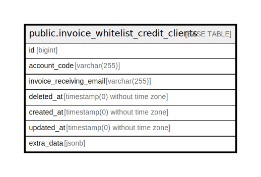

# public.invoice_whitelist_credit_clients

## Description

## Columns

| Name | Type | Default | Nullable | Children | Parents | Comment |
| ---- | ---- | ------- | -------- | -------- | ------- | ------- |
| id | bigint | nextval('invoice_whitelist_credit_clients_id_seq'::regclass) | false |  |  |  |
| account_code | varchar(255) |  | false |  |  |  |
| invoice_receiving_email | varchar(255) |  | false |  |  |  |
| deleted_at | timestamp(0) without time zone |  | true |  |  |  |
| created_at | timestamp(0) without time zone |  | true |  |  |  |
| updated_at | timestamp(0) without time zone |  | true |  |  |  |
| extra_data | jsonb |  | true |  |  |  |

## Constraints

| Name | Type | Definition |
| ---- | ---- | ---------- |
| invoice_whitelist_credit_clients_pkey | PRIMARY KEY | PRIMARY KEY (id) |

## Indexes

| Name | Definition |
| ---- | ---------- |
| invoice_whitelist_credit_clients_pkey | CREATE UNIQUE INDEX invoice_whitelist_credit_clients_pkey ON public.invoice_whitelist_credit_clients USING btree (id) |

## Relations

---

> Generated by [tbls](https://github.com/k1LoW/tbls)
