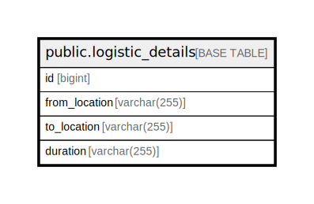

# public.logistic_details

## Description

## Columns

| Name | Type | Default | Nullable | Children | Parents | Comment |
| ---- | ---- | ------- | -------- | -------- | ------- | ------- |
| id | bigint | nextval('logistic_details_id_seq'::regclass) | false |  |  |  |
| from_location | varchar(255) |  | false |  |  |  |
| to_location | varchar(255) |  | false |  |  |  |
| duration | varchar(255) |  | false |  |  |  |

## Constraints

| Name | Type | Definition |
| ---- | ---- | ---------- |
| logistic_details_pkey | PRIMARY KEY | PRIMARY KEY (id) |

## Indexes

| Name | Definition |
| ---- | ---------- |
| logistic_details_pkey | CREATE UNIQUE INDEX logistic_details_pkey ON public.logistic_details USING btree (id) |
| logistic_details_from_location_index | CREATE INDEX logistic_details_from_location_index ON public.logistic_details USING btree (from_location) |

## Relations

---

> Generated by [tbls](https://github.com/k1LoW/tbls)
