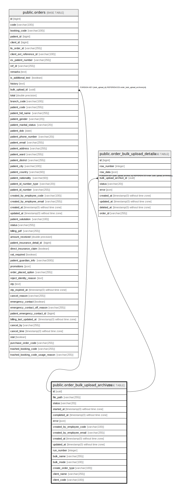

# public.order_bulk_upload_archives

## Description

## Columns

| Name | Type | Default | Nullable | Children | Parents | Comment |
| ---- | ---- | ------- | -------- | -------- | ------- | ------- |
| id | uuid |  | false | [public.orders](public.orders.md) [public.order_bulk_upload_details](public.order_bulk_upload_details.md) |  |  |
| file_path | varchar(255) |  | false |  |  |  |
| status | varchar(20) |  | false |  |  |  |
| started_at | timestamp(0) without time zone |  | true |  |  |  |
| completed_at | timestamp(0) without time zone |  | true |  |  |  |
| error | json |  | true |  |  |  |
| created_by_employee_code | varchar(100) |  | false |  |  |  |
| created_by_employee_email | varchar(255) |  | false |  |  |  |
| created_at | timestamp(0) without time zone |  | true |  |  |  |
| updated_at | timestamp(0) without time zone |  | true |  |  |  |
| run_number | integer | nextval('order_bulk_upload_archives_run_number_seq'::regclass) | true |  |  |  |
| bulk_name | varchar(255) |  | true |  |  |  |
| bulk_mode | varchar(100) | 'attune'::character varying | false |  |  |  |
| create_order_type | varchar(100) |  | true |  |  |  |
| client_name | varchar(255) |  | true |  |  |  |
| client_code | varchar(100) |  | true |  |  |  |

## Constraints

| Name | Type | Definition |
| ---- | ---- | ---------- |
| order_bulk_upload_archives_pkey | PRIMARY KEY | PRIMARY KEY (id) |
| order_bulk_upload_archives_run_number_unique | UNIQUE | UNIQUE (run_number) |

## Indexes

| Name | Definition |
| ---- | ---------- |
| order_bulk_upload_archives_status_index | CREATE INDEX order_bulk_upload_archives_status_index ON public.order_bulk_upload_archives USING btree (status) |
| order_bulk_upload_archives_started_at_index | CREATE INDEX order_bulk_upload_archives_started_at_index ON public.order_bulk_upload_archives USING btree (started_at) |
| order_bulk_upload_archives_completed_at_index | CREATE INDEX order_bulk_upload_archives_completed_at_index ON public.order_bulk_upload_archives USING btree (completed_at) |
| order_bulk_upload_archives_created_by_employee_code_index | CREATE INDEX order_bulk_upload_archives_created_by_employee_code_index ON public.order_bulk_upload_archives USING btree (created_by_employee_code) |
| order_bulk_upload_archives_created_by_employee_email_index | CREATE INDEX order_bulk_upload_archives_created_by_employee_email_index ON public.order_bulk_upload_archives USING btree (created_by_employee_email) |
| order_bulk_upload_archives_created_at_index | CREATE INDEX order_bulk_upload_archives_created_at_index ON public.order_bulk_upload_archives USING btree (created_at) |
| order_bulk_upload_archives_updated_at_index | CREATE INDEX order_bulk_upload_archives_updated_at_index ON public.order_bulk_upload_archives USING btree (updated_at) |
| order_bulk_upload_archives_pkey | CREATE UNIQUE INDEX order_bulk_upload_archives_pkey ON public.order_bulk_upload_archives USING btree (id) |
| order_bulk_upload_archives_run_number_unique | CREATE UNIQUE INDEX order_bulk_upload_archives_run_number_unique ON public.order_bulk_upload_archives USING btree (run_number) |

## Relations

---

> Generated by [tbls](https://github.com/k1LoW/tbls)
