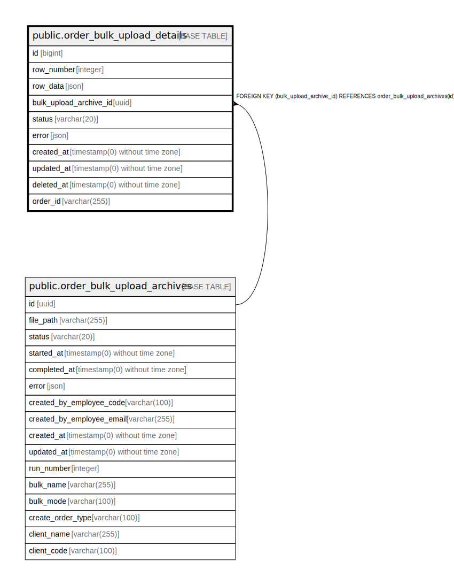

# public.order_bulk_upload_details

## Description

## Columns

| Name | Type | Default | Nullable | Children | Parents | Comment |
| ---- | ---- | ------- | -------- | -------- | ------- | ------- |
| id | bigint | nextval('order_bulk_upload_details_id_seq'::regclass) | false |  |  |  |
| row_number | integer |  | false |  |  |  |
| row_data | json |  | false |  |  |  |
| bulk_upload_archive_id | uuid |  | false |  | [public.order_bulk_upload_archives](public.order_bulk_upload_archives.md) |  |
| status | varchar(20) | 'in-progress'::character varying | false |  |  |  |
| error | json |  | true |  |  |  |
| created_at | timestamp(0) without time zone |  | true |  |  |  |
| updated_at | timestamp(0) without time zone |  | true |  |  |  |
| deleted_at | timestamp(0) without time zone |  | true |  |  |  |
| order_id | varchar(255) |  | true |  |  |  |

## Constraints

| Name | Type | Definition |
| ---- | ---- | ---------- |
| order_bulk_upload_details_bulk_upload_archive_id_foreign | FOREIGN KEY | FOREIGN KEY (bulk_upload_archive_id) REFERENCES order_bulk_upload_archives(id) |
| order_bulk_upload_details_pkey | PRIMARY KEY | PRIMARY KEY (id) |
| order_bulk_upload_details_bulk_upload_archive_id_row_number_uni | UNIQUE | UNIQUE (bulk_upload_archive_id, row_number) |

## Indexes

| Name | Definition |
| ---- | ---------- |
| order_bulk_upload_details_pkey | CREATE UNIQUE INDEX order_bulk_upload_details_pkey ON public.order_bulk_upload_details USING btree (id) |
| order_bulk_upload_details_status_index | CREATE INDEX order_bulk_upload_details_status_index ON public.order_bulk_upload_details USING btree (status) |
| order_bulk_upload_details_created_at_index | CREATE INDEX order_bulk_upload_details_created_at_index ON public.order_bulk_upload_details USING btree (created_at) |
| order_bulk_upload_details_updated_at_index | CREATE INDEX order_bulk_upload_details_updated_at_index ON public.order_bulk_upload_details USING btree (updated_at) |
| order_bulk_upload_details_bulk_upload_archive_id_row_number_uni | CREATE UNIQUE INDEX order_bulk_upload_details_bulk_upload_archive_id_row_number_uni ON public.order_bulk_upload_details USING btree (bulk_upload_archive_id, row_number) |

## Relations

---

> Generated by [tbls](https://github.com/k1LoW/tbls)
