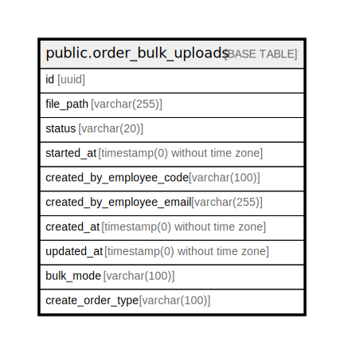

# public.order_bulk_uploads

## Description

## Columns

| Name | Type | Default | Nullable | Children | Parents | Comment |
| ---- | ---- | ------- | -------- | -------- | ------- | ------- |
| id | uuid |  | false |  |  |  |
| file_path | varchar(255) |  | false |  |  |  |
| status | varchar(20) |  | false |  |  |  |
| started_at | timestamp(0) without time zone |  | true |  |  |  |
| created_by_employee_code | varchar(100) |  | false |  |  |  |
| created_by_employee_email | varchar(255) |  | false |  |  |  |
| created_at | timestamp(0) without time zone |  | true |  |  |  |
| updated_at | timestamp(0) without time zone |  | true |  |  |  |
| bulk_mode | varchar(100) | 'attune'::character varying | false |  |  |  |
| create_order_type | varchar(100) |  | true |  |  |  |

## Constraints

| Name | Type | Definition |
| ---- | ---- | ---------- |
| order_bulk_uploads_pkey | PRIMARY KEY | PRIMARY KEY (id) |

## Indexes

| Name | Definition |
| ---- | ---------- |
| order_bulk_uploads_status_index | CREATE INDEX order_bulk_uploads_status_index ON public.order_bulk_uploads USING btree (status) |
| order_bulk_uploads_created_by_employee_code_index | CREATE INDEX order_bulk_uploads_created_by_employee_code_index ON public.order_bulk_uploads USING btree (created_by_employee_code) |
| order_bulk_uploads_created_by_employee_email_index | CREATE INDEX order_bulk_uploads_created_by_employee_email_index ON public.order_bulk_uploads USING btree (created_by_employee_email) |
| order_bulk_uploads_created_at_index | CREATE INDEX order_bulk_uploads_created_at_index ON public.order_bulk_uploads USING btree (created_at) |
| order_bulk_uploads_updated_at_index | CREATE INDEX order_bulk_uploads_updated_at_index ON public.order_bulk_uploads USING btree (updated_at) |
| order_bulk_uploads_pkey | CREATE UNIQUE INDEX order_bulk_uploads_pkey ON public.order_bulk_uploads USING btree (id) |

## Relations

---

> Generated by [tbls](https://github.com/k1LoW/tbls)
